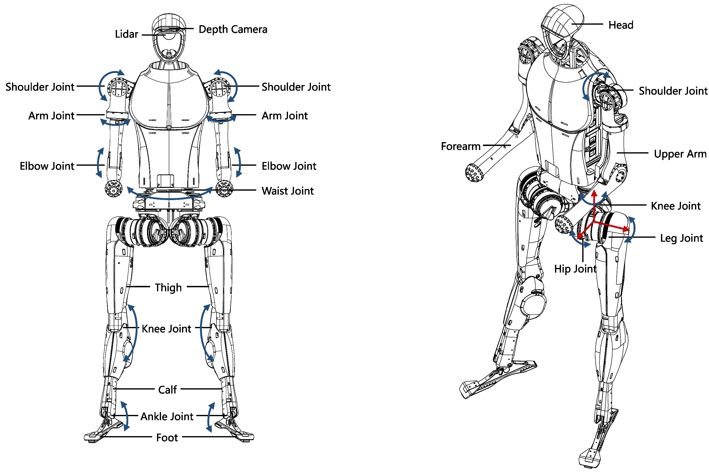
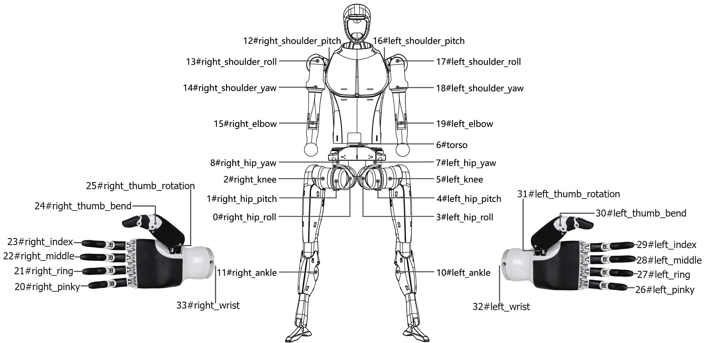
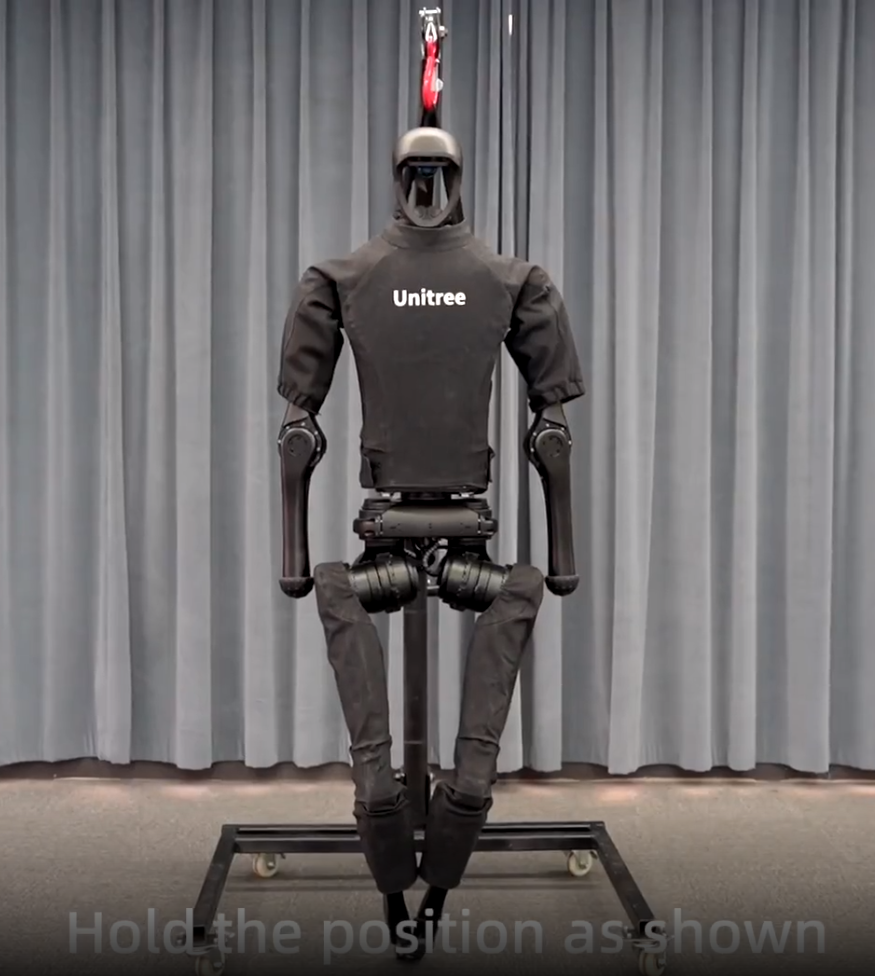

# Полезные ссылки:

[Репозиторий unitree_sdk2(C++)](https://github.com/unitreerobotics/unitree_sdk2)

[Репозиторий unitree_sdk2_python (Python)](https://github.com/unitreerobotics/unitree_sdk2_python)

[Репозиторий unitree_ROS2 (C++)](https://github.com/unitreerobotics/unitree_ros2)

[Информация о модуле рук от производителя Inspire hands](https://support.unitree.com/home/en/H1_developer/Dexterous_hand)

[For developers from unitreerobotics](https://support.unitree.com/home/en/H1_developer/About_H1)	

[OpenSource-ресурсы с официального сайта](https://www.unitree.com/opensource)

[Github разработчиков](https://github.com/unitreerobotics)

[Структуры сообщений](https://support.unitree.com/home/en/H1_developer/Basic_Services_Interface)

[Высокоуровневое управление от официалов](https://support.unitree.com/home/en/H1_developer/Sports_Services_Interface)

[Наш аккаунт на gihub](https://github.com/cyberbanana777)

### **Комментарий по репозиториям**:
В sdk лежат примеры управления роботом через DDS напрямую, без ROS2. В репозитории, связанным с ROS2, лежат типы сообщений и несколько примеров управления роботом через ROS2 (ноды написаны на C++). Среди примеров работают на роботе unitree H1 далеко не все.
Примеры управления роботом, которые точно работают:

**ROS2 (C++**)
[Пример №1](https://github.com/unitreerobotics/unitree_ros2/blob/master/example/src/src/read_low_state.cpp)

**SDK_python**

[Пример №2](https://github.com/unitreerobotics/unitree_sdk2_python/blob/master/example/h1/low_level/h1_low_level_example.py) (Требует перевода в `режим разработки` . См. ниже )

[Пример №3](https://github.com/unitreerobotics/unitree_sdk2_python/blob/master/example/wireless_controller/wireless_controller.py)(Здесь для корректной работы необходимо закомментить 12 и 13 строчку и раскомментить 8 и 9)

# Общие моменты
[Соответствие моторов и их индексов](https://support.unitree.com/home/en/H1_developer/Joint_motor_sequence)


### Важный момент при работе с sdk.
При запуске скрипта на роботе указывать интерфейс подключения не обязательно. Он его сам подтянет. При запуске с локальной машины (своего ноута к примеру) интерфейс необходимо указать __обязательно__! Иначе управляющие команды могут слаться туда, куда не нужно.

## Управление через ROS2
Примеры использования нод, управляющих движениями на low_level уровне. 
> нужно указать что это мы сами написали и протестировали

[[Пример управления звеньями через ROS2]] - позвенное управление роботом

Ведя разработку ПО для данного робота, мы объединили всё самое важное для управления роботом в одном [репозитории](https://github.com/cyberbanana777/unitree_h1_control_ws). В нём содержатся ROS2-пакеты, которые позволяют контролировать движения робота. Рекомендуем ознакомиться с докуметацией к нему. + Часто используемые блоки кода вы объединили в библиотеку, что может помочь в будущей разработке.

# Перед запуском нод
Все действия с роботом, реализованные с помощью данных пакетов. **не требуют перевода его в режим разработчика**. 
Но для корректной работы нод, управляющих движением рук, **необходимо перевести робота в режим балансирования**. 
Сделать это можно как с пульта (см. в другой [методичке]() - позже появится ссылка ) или через клиент, последовательно выполнив действия:
1. `damp`
2. `stand_up`
3. `start`
## **Важно!!!** 
Первые 2 пункта робот должен выполнять в воздухе (в подвешенном состоянии) - чтобы ничего не мешало его движениям. Перед выполнением последнего пункта необходимо опустить робота, чтобы его ноги соприкоснулись с полом и встали на него полностью. Последняя функция активирует режим балансирования - робот будет перебирать ногами, до тех пор пока не установит равновесие.

## Защита от дураков на исполняющем устройстве отсутствует! 
На моторы **нельзя**!!! подавать значения координат, которые выходят за пределы нормальной эксплуатации. Внимательно ознакомьтесь с пределами координат моторов перед программированием. Пределы координат можно найти [здесь](https://support.unitree.com/home/en/H1_developer) или в нашей [python-библиотеке](https://github.com/cyberbanana777/unitree_h1_control_ws?tab=readme-ov-file#-%D0%BA%D0%B0%D1%81%D1%82%D0%BE%D0%BC%D0%BD%D1%8B%D0%B5-%D0%B1%D0%B8%D0%B1%D0%BB%D0%B8%D0%BE%D1%82%D0%B5%D0%BA%D0%B8), которая является частью репозитория для контроля робота 

## Контроль заряда аккумуляторов
Робот работает на 2 аккумуляторах. **НЕ имеет** какой либо системы предотвращения полного разряда. Отслеживать заряд аккумуляторов нужно визуально (если 1 лампочка горит, моргаяя, а оставльные не горят - аккумулятор необходимо срочно поменять). Программного отслеживания заряда аккумулятора нет - производитель не предусмотрел. Возможен только визуальный контроль.

### Нюансы при подключении к роботу
Возможны следующие варианты подключения:
1. Робот подключён в роутеру через ethernet или WIFI-адаптер.
2. Робот подключён напрямую к Вашему компьютеру.
В любом из представленных случаев необходимое условие работы - IP-адрес сети, в которой находится робот должен быть следующего формата:
```
192.168.123.xxx
```
Как это сделать:
1. В настройках роутера
2. В настройках ethernet-порта компьютера

**192.168.123.161** - Вычислительный блок №1 (далее PC1). На нём крутится прошивка от производителя. Доступа к нему нет.
**192.168.123.162** - Вычислительный блок №2 (далее PC2). На нём можно запускать свои программы, а также слушать топики.
В документации к роботу ещё указано, что может присутствовать вычислительный блок №3 с IP-адресом **192.168.123.163**. На наших роботах данного расширения нет.

#### Подключение по SSH
Подключение к PC2 возможно по следующей команде:
```bash
ssh unitree@192.168.123.162
```
Далее будет запрошен пароль. Необходимо ввести:
`Unitree0408`

## Неочевидные проблемы, с которыми мы столкнулись
1. **Не правильная дата и время в Linux'е PC2.** Из-за этого возникали проблемы с доступом в интернет. 
		Командой `ping 8.8.8.8` можно проверить возможность доступа к общедоступным сайтам. Если пакеты идут, а какой-нибудь git-репозиторий не качается - проблема здесь. Если нет - то см. пункт 2.
```bash
sudo date --set "2025-04-14 01:49:00"
```
2. **Не указан Gateway (шлюз) в настройках сетевого интерфейса eth0.** 
		Если ошибка содержит *"Network is unreachable"* Скорее всего проблема здесь. Решается эта проблема командой
```bash
sudo ip route add default via 192.168.123.1 dev eth0
```

## Особенности работы 
У робота есть несколько режимов. 

Возможно несколько возможностей управлять роботом
1. С пульта ДУ
2. Командами верхнего уровня "High_level"
3. Командами нижнего уровня "Low_level"

**Подробнее про каждый из них:**
1. Для управления с пульта достаточно включить пульт и робота. Они приконектятся автоматически (номер робота и пульта должны совпадать). Пульт, как и робот, включаются последовательными 1 коротким и 1 длинным нажатием (у робота обе батареи необходимо включить синхронно). Для движения робота необходимо перевести в режим `Damping` и затем в режим `Preparation`. Подробнее о режимах можно прочитать [здесь](https://support.unitree.com/home/en/H1_developer/Remote_control)
2. Для управления High_level командами нужно сделать тоже самое, что и в пункте 1. (Перевести в режимы `Damping`, `Prepatation` и другие можно также программно)
3.1 Для управления Low_level командами робота необходимо перевести  в режим  `Develop`. Если этого не сделать, произойдёт конфликт команд и робот начнёт дёргаться. 
3.2 Можно управлять торсом и сочленениями, которые находятся выше, не переходя в режим разработчика. Для этого целевые команды нужно слать в таком же формате как и в режиме разработчика, но в топик `/arm_sdk`.
## Важный момент про режим `Develop`
Перевести робота в режим `Develop`, можно как программно, так и с помощью пульта. Но вывести из данного режима можно или программно, или с помощью перезагрузки всего робота. Пример программного перехода в режим `Develop` можно посмотреть [тут](https://github.com/unitreerobotics/unitree_sdk2_python/blob/master/example/h1/low_level/h1_low_level_example.py) (Переход происходит косвенно, в создании клиента). Пример возврата из режима `Develop` можно посмотреть [тут](https://github.com/unitreerobotics/unitree_sdk2_python/blob/master/example/motionSwitcher/motion_switcher_example.py) (Работает только режим `ai`, остальные при попытке активации дают ошибку).

**Важный момент про High_level управление:**
В примере клиента по не хватает команд для полного функционала.
Если открыть модуль, который описывает класс клиента, который используется в данном примере, то можно увидеть большее количество функций. В примере не хватает 2 функций:
`Start`, `StopMove`. Функция `Start` позволяет роботу перейти из режима `Damping` в режим `Preparation`, в котором он стоит и держит баланс. `StopMove` останавливает движение.

**Алгоритм управления роботом в данном клиенте следующий:**
1. Перевести робота в режим `Damp`
2. Перевести в режим `stand_up`
3. Перевести в режим `start` (Как раз его и не хватает в оригинале)
После этого робот сможет исполнять остальные высокоуровневые команды, представленные в данном клиенте.
Пример исправленного клиента можно посмотреть в другой заметке. Гиперссылка на доработанный дефолтный пример кода от произыодителя-> [[Пример исправленного клиента]]
Мы также переработали его и сделали немного красивым. Получилось 2 варианта исполнения. Подробнее Вы можете рассмотреть ROS2-пакет `high_level_control` в [данном репозитории](https://github.com/cyberbanana777/unitree_h1_control_ws)


## Структура топиков на роботе и работа с ними
ROS2 в данной конфигурации использует в качестве DDS (система, которая занимается транспортировкой данных) cyclonedds. Слушать топики можно 2 способами:
1. **Классический способ через команды ROS2.** Этот метод требует, чтобы предварительно были засуршены (`source unitree_ros2/cyclonedds_ws/intsall/local_setup.bash`) типы сообщений, которые предварительно необходимо скомпилировать (см. гайд по установке и компиляции в [репозитории](https://github.com/unitreerobotics/unitree_ros2/tree/master)). Пример: `ros2 topic echo /lowstate`
2. **Через CLI-утилиту от cyclonedds.** Не требует ни какой компиляции. Программа называется `cyclonedds`. Основные команды:
	- `cyclonedds ls` - выводит топики и точки входа в них
	- `cyclonedds ps` - выводит подробную информацию о каждом из топиков, их QoS и др.
	- `cyclonedds subscribe {имя топика}` - слушает топик и выводит содержимое
	- `cyclonedds -h` - справка о возможностях утилиты
**Примечание**: топики в обоих случаях называются одинаково, только в CLI-утилите ко всем топикам добавляется префикс `rt`, который обозначает принадлежность к ROS2. (Предположительно от сокращения `Ros Topic`).
### Основные топики:
**Примечание**: используются названия для топиков ROS2, без префикса `rt`
- `lowstate` - Информация о состоянии системы в данный момент. Включает координаты моторов, температуру различных частей, показания IMU-блока.
- `lowcmd` - Через этот топик можно управлять Low_level движением.
- `arm_sdk` - Через него можно управлять верхней частью робота через Low level
- `api/motionswitcher/request` - здесь можно отследить запрос на переход в другой режим (`develop`/`режим высокоуровневого управления`)
- `api/motionswitcher/response` - ответ на запрос о смене режима.
- `api/loco/request` - здесь можно отследить запрос управление роботом (например задача выполнения танца, перехода в состояние балансирования и т.д)
- `api/loco/response` - ответ на запрос о реализации желаемой задачи.
- `odommodestate` - содержит информацию об одометрии (координаты x, y, z) и скорость вращения вокруг оси z.


### Координаты робота
Робот инициализирует координаты при включении. Энкодеры на моторах относительные, т.е. положение из которого Вы запускаете робота должно быть не произвольным, а вполне конкретным (указано на рисунке). Более подробную информацию можно найти [здесь](https://docs.quadruped.de/projects/h1/html/controller.html)





## Как управлять руками во время движения
Чтобы совместить high_level управление и кастомное движение рук необходимо перевести робота в режим управления high_level командами или с пульта. Затем необходимо постить в топик `rt/arm_sdk` сообщение типа `lowcmd`. 
### Неочевидный момент
В сообщении есть неиспользуемое поле: поле мотора с индексом 9. Это поле используется для перехвата управления. Его нужно руками задавать на протяжении всего управления, т.е. задавать этого поле в каждом из сообщений. Если отослать сообщение без указания этого поля - руки робота примут позу, необходимую для балансирования.

Управлять через `arm_sdk` в режиме `develop` нельзя.


# Сенсоры
Данный блок представляет собой описание сенсоров, которые есть на роботе и работа с ними.
## Энкодеры (положения валов моторов)
Для получения этой информации ничего устанавливать не нужно. Эта информация содержится в топике `lowstate` в поле  `motor_state`. Оно представляет собой массив на 20 элементов, где номер начинается с 0 и соответствует индексации моторов.
Если на роботе установлены руки-манипуляторы Inspire Hands, то о том как получить информацию о них ищите [тут](https://github.com/cyberbanana777/unitree_h1_control_ws) 
## IMU
Для получения этой информации ничего устанавливать не нужно. Эта информация содержится в топике `lowstate` в поле  `imu_state`. 
## Lidar
Полное название лидара:
`Livox MID360`
Получение информации с лидара будет описано здесь. На данный момент документации нет, она находится в разработке. Но есть код, который работает.
Для удобства работы с датчиками мы разработали ROS2-пакеты и поместили их в отдельный [репозиторий](https://github.com/cyberbanana777/unitree_h1_sensors_ws).
Лидар может работать в 2 режимах:
- Генерирует сообщения custom-формата, разработанного Livox
- Генерирует сообщения типа `PointCloud2`

Также при запуске лидар с любым типом сообщения публикует информацию с imu, который находится внутри лидара и имеет аппаратную синхронизацию с публикаций точек. 

## Камера
> Находится в разработке...

# Визуализация движений
Мы доработали urdf-описание от производителя и добавили недостающие link's . В данном [репозитории](https://github.com/cyberbanana777/unitree_h1_visualization_ws) представлены ROS2-пакеты, которые решают задачи визуализации. Для получения более подробных сведений читайте документацию в данном репозитории.  
Отдельный пакет с urdf-описанием для ROS2 выложен [здесь](https://github.com/cyberbanana777/description_unitree_H1_ROS2).

# Дополнительные модули
Описывать всё, что мы делаем с роботами не имеет смысла, т.к. это избыточная информация для этого руководства. НО Вы можете посмотреть на этом [github](https://github.com/cyberbanana777?tab=repositories) репозитории, которые начинаются с `unitree_h1_*`. Эти репозитории содержать ROS2-пакеты, которые решают некоторые задачи (программирование по точкам, визализация и т.д.). Также некоторые модули ещё находятся в разработке.

## 💡 Предложения и корректировки
Если Вы нашли, ошибку, неточность, у Вас есть предложения по улучшению или вопросы, то напишите в телеграмм [сюда](https://t.me/Alex_19846) (Александр) или [сюда](https://t.me/Kika_01) (Алиса).

