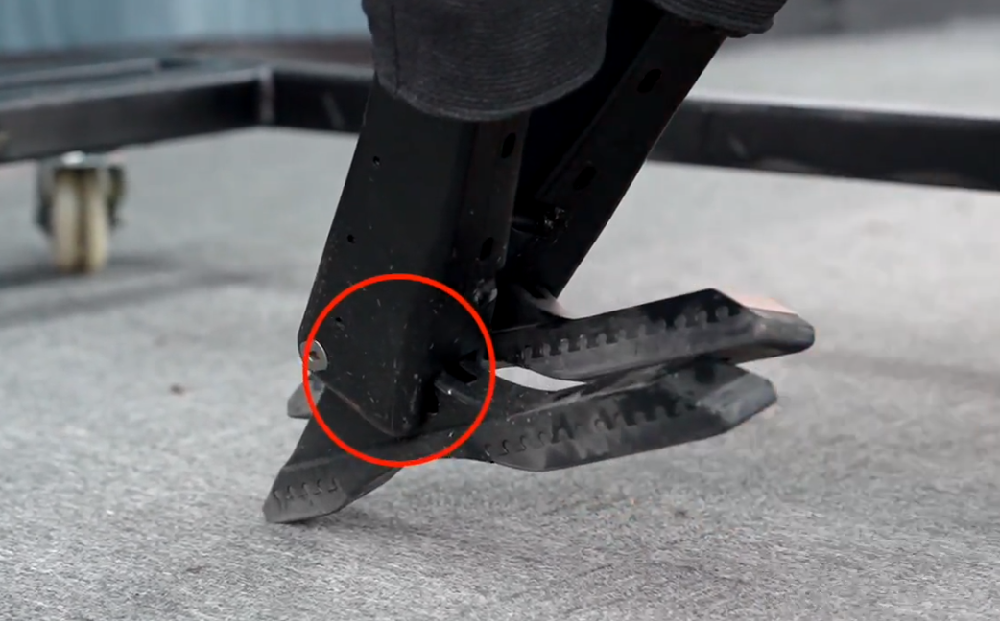

# **Руководство по Unitree H1**

## 1. Введение и быстрый старт
### **1.1. О роботе Unitree H1:** Краткое описание возможностей и комплектации.

Unitree H1 — это полноразмерный антропоморфный (человекоподобный) робот, разработанный для исследований в области робототехники и искусственного интеллекта. Его ключевые особенности: высокая подвижность (до 3.3 м/с), 20 степеней свободы (34 в доработанной версии с пальцами), встроенные системы зрения и лидар, а также возможность оснащения манипуляторами Inspire Hands (доработанная версия). Комплектация позволяет работать как с высокоуровневыми командами (ходьба, баланс), так и с низкоуровневым управлением каждым мотором.
### **1.2. Цель данного руководства:** Что читатель найдет внутри.

Данное руководство — это практическое собрание знаний, инструкций и решений, полученных в ходе непосредственной работы с H1. Вы найдете здесь не только официальную информацию, но и проверенные примеры кода, обходные пути для типичных проблем и наши собственные разработки, которые помогут вам быстро начать и эффективно работать с этим роботом, избегая многих подводных камней.
### **1.3. Быстрый старт (шаги для первого включения):**

#### Стартовое положение

Робот инициализирует координаты при включении. Энкодеры на моторах относительные, т.е. положение, из которого Вы запускаете робота, должно быть вполне конкретным (указано на рисунке). Более подробную информацию можно найти [здесь](https://docs.quadruped.de/projects/h1/html/controller.html).




#### Включение робота и пульта ДУ
1.  **Робот:** Нажмите и отпустите кнопку на каждой из двух батарей (**короткое нажатие**), затем снова нажмите и удерживайте каждую кнопку примерно на 2 секунды (**длинное нажатие**). Индикаторы на батареях должны загореться.
2.  **Пульт:** Нажмите и отпустите кнопку питания (**короткое нажатие**), затем снова нажмите и удерживайте её около 2 секунд (**длинное нажатие**).
3.  **Связь:** Робот и пульт свяжутся автоматически, если их номера совпадают (номер указан на задней части таза робота и на оборотной стороне пульта).
### 1.1 Запуск для движения с пульта

Для управлением роботом с пульта нужно последовательно выполнить команды:
*   **L1 + A:** Войти в режим `Damping` (Робот висит ноги могут касаться пола, но чуть-чуть).
*   **L1 + UP:** Перейти из `Damping` в `StandUp/Preparation` (Робот приходит в состояние готовое к ходьбе, руки параллельно полу).
*   Опускаем робота с висилицы пока ноги на встанут на пол полностью и он не начёт немного заваливаться вперёд.
*   **R2 + X:** Активировать `Sports Mode`, чтобы перейти балансированию и ходьбе с пульта. 
### 1.2 Запуск для программирование робота 

#### **Режим работы**

* Если нужно управлять **всеми** моторами робота, нужно перевести робота в режим  `Develop`.
    *   **L1 + A:** Войти в режим `Damping` (из любого состояния).
    *   **L2 + R2:** **Комбинация для входа в `Develop` режим** (только в подвешенном состоянии и из режима `Damping`).
* Если нужно управлять **только верхними конечностями и торсом**, выполняем инструкцию пункта 1.1.

#### **Настройка сети для подключения**
Для связи с роботом ваша сеть **должна** использовать диапазон адресов: **`192.168.123.xxx`**

**Способ 1: Через роутер**
*   Подключите робота к роутеру с помощью кабеля Ethernet или Wi-Fi-адаптера.
*   В настройках роутера задайте статический IP-адрес или настройте DHCP-сервер так, чтобы он раздавал адреса в нужном диапазоне.

**Способ 2: Прямое подключение к компьютеру**
*   Соедините компьютер и робота кабелем Ethernet.
*   На своем компьютере зайдите в **Настройки сети** → **Ethernet** → **Параметры IP**.
*   Выберите **"Вручную"** и настройте подключение:
    *   **IP-адрес:** `192.168.123.100` (или любое число кроме `120`, `161`, `162`)
    *   **Маска подсети:** `255.255.255.0`
#### Проверка связи
Убедитесь, что робот откликается, запустив простую команду чтения его состояния.

1.  **Подключитесь по SSH:**
    ```bash
    ssh unitree@192.168.123.162
	# Пароль: Unitree0408
    ```

2.  **Запустите пример (на стороне робота):**
    *   Активируйте рабочее окружение (если нужно).
    *   Запустите простой скрипт для чтения топика `lowstate`. Например, командами:
 	```bash
  	cyclonedds ls
  	cyclonedds subscribe rt/lowstate
  	```
    *   Если в терминале начали появляться данные со состояниями моторов и датчиков — подключение установлено успешно!
	* Небольшое пояснение: `cyclonedds` - это python-пакет вместе с CLI-утилитами, реализующий DDS-слой (транспортировка данных, один из слоёв ROS2). Представление типоков в ROS2 и в DDS немного отличается. Т.к. для просмотра мы используем DDS, то топик имеет имя не `/lowstate` (как в ROS2), `rt/lowstate` - это топик, который отслеживает состояние моторов и датчиков робота.

## 2. Примеры кода

###  **2.1. SDK и ROS2 от производителя:**

В sdk лежат примеры управления роботом через DDS напрямую, без ROS2. В репозитории, связанном с ROS2, лежат типы сообщений и несколько примеров управления роботом через ROS2 (ноды написаны на C++). Почти все примеры не работают непосредственно на самом роботе Unitree H1.
Примеры управления роботом, которые точно работают:

**ROS2 (C++**)

[Пример №1](https://github.com/unitreerobotics/unitree_ros2/blob/master/example/src/src/read_low_state.cpp)

**SDK_python**

[Пример №2](https://github.com/unitreerobotics/unitree_sdk2_python/blob/master/example/h1/low_level/h1_low_level_example.py) (Требует перевода в `режим разработки` . См. ниже )

[Пример №3](https://github.com/unitreerobotics/unitree_sdk2_python/blob/master/example/wireless_controller/wireless_controller.py)(Здесь для корректной работы необходимо закомментить 12 и 13 строчку и раскомментить 8 и 9)

###  **2.2. Наши примеры на ROS2:**
Примеры который мы сами написали протестировали.

* [[examples/Пример_управления_звеньями_через_ROS2]] - позвенное управление роботом

Ведя разработку ПО для данного робота, мы объединили всё, что относится к управлению роботом в одном [репозитории](https://github.com/cyberbanana777/unitree_h1_control_ws). Рекомендуем ознакомиться с документацией к репозиторию. Так же часто используемые блоки кода мы объединили в библиотеку, что может помочь в будущей разработке.

Пример исправленного High_level  клиента можно посмотреть здесь [[examples/Пример_исправленного_клиента]]
Мы также переработали его, добавили несколько дополнительных функций и сделали по егокрасивее. Получилось 2 варианта исполнения. Подробнее Вы можете рассмотреть ROS2-пакет `high_level_control` в [данном репозитории](https://github.com/cyberbanana777/unitree_h1_control_ws)

## 3. Основы архитектуры и управления

### 3.1. Режимы работы робота

У робота есть несколько режимов.  Подробнее о режимах можно прочитать [здесь](https://support.unitree.com/home/en/H1_developer/Remote_control).

#### Назначение каждого режима

*   **Damping (Демпфирование):**
    *   **Назначение:** Режим безопасности и стартовое состояние. Все моторы робота **прекращают активное движение**, но сохраняют демпфирование (сопротивление при внешнем воздействии). Это позволяет вручную перемещать конечности робота, например, для придания правильной стартовой позы. В этом режиме робот может упасть, если не закреплен.
    *   **Важно:** Это единственный режим, из которого можно безопасно выключить робота.

*   **StandUp/Preparation (Подготовка):**
    *   **Назначение:** Промежуточный этап между Damping и движением. Робот переходит расслабленного состояния в стоячее положение, готовое к работе. Руки поднимаются и устанавливаются параллельно земле.

*   **Balance/Walking (Балансировка/Ходьба):**
    *   **Назначение:** Основной режим для перемещения. Робот активно балансирует, стоит на месте или выполняет команды движения (ходьба, повороты), получаемые с пульта ДУ или через High-Level клиент. В этом режиме система автоматически корректирует положение тела для поддержания равновесия.

*   **Develop/Debug Mode (Режим разработчика):**
    *   **Назначение:** Режим для низкоуровневого программирования и отладки. **Встроенная система управления движением отключается** и прекращает посылать какие-либо команды моторам. Это позволяет разработчику иметь полный и исключительный контроль над всеми приводами через Low-Level управление без риска конфликта команд.
    *   **ВАЖНО:** Вход в этот режим разрешен **только когда робот подвешен** для безопасности. Активация его на земле может привести к отсутствию стабилизации и падению.

#### Как переключаться между режимами

Переключение режимов возможно двумя основными способами:

1.  **С пульта ДУ:**
    *   **L1 + A:** Войти в режим `Damping` (из любого состояния).
    *   **L1 + UP:** Перейти из `Damping` в `StandUp/Preparation`.
    *   **R2 + X:** Активировать `Sports Mode`, чтобы перейти к ходьбе.
    *   **L2 + R2:** **Комбинация для входа в `Develop` режим** (только в подвешенном состоянии и из режима `Damping`).
    *   **L2 + A:** В режиме `Develop` — принять диагностическую позу для подтверждения успешного входа.
    *   **L2 + B:** Выйти из диагностической позы обратно в `Develop`.

2.  **Программно:**
	(работающий пример High_level клиента см. п. 2.2)
    *   **High-Level:** Позволяет отправлять команды, аналогичные пульту ДУ. Это основной способ автоматизированного управления на высоком уровне.


**Важное ограничение:** 
Выход из режима `Develop` обратно в стандартные режимы возможен **только программно** с `motion switcher` клиентом или через **полную перезагрузку** робота. Пульт ДУ не может вывести робота из `Develop` режима. [Код реализации вы можете посмотреть здесь](https://github.com/unitreerobotics/unitree_sdk2_python/blob/master/example/motionSwitcher/motion_switcher_example.py)

---
### 3.2. Управление с пульта

*   **Описание:** Физический пульт управления для непосредственного контроля за роботом оператором. Связь между роботом и пультом устанавливается автоматически при включении, если их серийные номера совпадают.
*   **Процесс:** Включение пульта и робота осуществляется последовательным коротким и длинным нажатием кнопок питания.
*   **Назначение:** Идеален для базового контроля, первоначальной настройки, тестирования и обеспечения безопасности (аварийная остановка — `L1+A`). Является обязательным инструментом для безопасного запуска и перевода робота в нужные режимы перед программным управлением.

###   **3.3. Анатомия и компьютеры робота (ВАЖНОЕ ПРЕДУПРЕЖДЕНИЕ):**
[Соответствие моторов и их индексов](https://support.unitree.com/home/en/H1_developer/Joint_motor_sequence)


 #### **Адреса компьютеров Unitree H1:**
**192.168.123.161** - Вычислительный блок №1 (далее PC1). На нём крутится прошивка от производителя. Доступа к нему нет.
**192.168.123.162** - Вычислительный блок №2 (далее PC2). На нём можно запускать свои программы, а также слушать топики.
В документации к роботу ещё указано, что может присутствовать вычислительный блок №3 с IP-адресом **192.168.123.163**. На наших роботах данного расширения нет.
#### **!!Защита от дураков на исполняющем устройстве отсутствует!!** 
На моторы **нельзя**!!! подавать значения координат, которые выходят за пределы указанные на сайте производителя. Внимательно ознакомьтесь с пределами положений моторов перед программированием. Пределы можно найти [здесь](https://support.unitree.com/home/en/H1_developer#:~:text=high%2Dprecision%20control.-,Joint%20Numbering%20and%20Joint%20Limits,-Joint%20Number) или в нашей [python-библиотеке](https://github.com/cyberbanana777/unitree_h1_control_ws?tab=readme-ov-file#-%D0%BA%D0%B0%D1%81%D1%82%D0%BE%D0%BC%D0%BD%D1%8B%D0%B5-%D0%B1%D0%B8%D0%B1%D0%BB%D0%B8%D0%BE%D1%82%D0%B5%D0%BA%D0%B8), которая является частью репозитория для контроля робота. 

###   **3.4. Система сообщений (DDS/ROS2):**
#### Обзор CycloneDDS.
**Ключевые топики:**(`/lowstate`, `/lowcmd`, `/arm_sdk`, `/api/*`).
**Как слушать топики**: через `ros2 topic echo <имя топика>` и утилиту `cyclonedds subscribe rt/<имя топика>`.

## 4. Практическое программирование под H1
###   **4.1. Предупреждения и меры безопасности:**
#### **1. Контроль заряда батареи (отсутствие программной защиты).**
Робот работает на 2 аккумуляторах. **НЕ имеет** какой либо системы предотвращения полного разряда. Отслеживать заряд аккумуляторов нужно визуально (если 1 лампочка горит (особенно красным), моргая, а остальные не горят - аккумулятор необходимо срочно поменять). Программного отслеживания заряда аккумулятора нет, производитель не предусмотрел это. Возможен только визуальный контроль (возможно после обновления это изменится).

#### **2 . Опасность выхода за пределы углов моторов.**
Не подавайте на моторы значения координат, выходящие за пределы, указанные производителем. Ознакомьтесь с пределами положений на сайте Unitree или в нашей Python-библиотеке. (см. п. 3.3)

#### **3. Важность правильного стартового положения.**
Перед включением установите робота в конкретное стартовое положение, так как энкодеры инициализируют координаты относительно начальной точки. Подробности смотрите в документации. (см. п. 1.3)

###  **4.2. Структура топиков на роботе и работа с ними:**

ROS2 в данной конфигурации использует в качестве DDS (система, которая занимается транспортировкой данных) cyclonedds. Слушать топики можно 2 способами:
1. **Классический способ через команды ROS2.** Этот метод требует, чтобы предварительно были засуршены (`source unitree_ros2/cyclonedds_ws/intsall/local_setup.bash`) типы сообщений, которые необходимо скомпилировать (см. гайд по установке и компиляции в [репозитории](https://github.com/unitreerobotics/unitree_ros2/tree/master)). Пример: `ros2 topic echo /lowstate`
2. **Через CLI-утилиту от cyclonedds.** Не требует подготовки. Программа называется `cyclonedds`. Основные команды:
	- `cyclonedds ls` - выводит топики и точки входа в них
	- `cyclonedds ps` - выводит подробную информацию о каждом из топиков, их QoS и др.
	- `cyclonedds subscribe {имя топика}` - слушает топик и выводит содержимое
	- `cyclonedds -h` - справка о возможностях утилиты
**Примечание**: топики в обоих случаях называются одинаково, только в CLI-утилите ко всем топикам добавляется префикс `rt`, который обозначает принадлежность к ROS2. (Предположительно от сокращения `Ros Topic`).
#### **Основные топики:**
**Примечание**: используются названия для топиков ROS2, без префикса `rt`
- `lowstate` - Информация о состоянии системы в данный момент. Включает координаты моторов, температуру различных частей, показания IMU-блока.
- `lowcmd` - Через этот топик можно управлять Low_level движением.
- `arm_sdk` - Через него можно управлять верхней частью робота через Low level
- `api/motionswitcher/request` - здесь можно отследить запрос на переход в другой режим (`develop`/`режим высокоуровневого управления`)
- `api/motionswitcher/response` - ответ на запрос о смене режима.
- `api/loco/request` - здесь можно отследить запрос управление роботом (например задача выполнения танца, перехода в состояние балансирования и т.д)
- `api/loco/response` - ответ на запрос о реализации желаемой задачи.
- `odommodestate` - содержит информацию об одометрии (координаты x, y, z) и скорость вращения вокруг оси z.

### 4.2. High-Level клиент (Команды верхнего уровня)
*   **Описание:** Программный интерфейс, предоставляющий абстрактные команды, аналогичные функциям пульта ДУ (например, "встать", "идти вперед", "остановиться").
*   **Как использовать:** Для работы необходимо перевести робота в соответствующий режим (`Damping` -> `StandUp` -> `Start`) с помощью самого же клиента или пульта, после чего можно отправлять команды движения.

**Важный нюанс:** Стандартный пример клиента от Unitree не полный. В нём отсутствуют ключевые команды `Start` (для перехода в режим балансировки) и `StopMove` (для остановки движения). Работающий пример High_level клиента см. п. 2.2.

### 4.3. Low-Level (Прямое управление всеми моторами)
  **Описание:** Низкоуровневый интерфейс, позволяющий напрямую задавать целевые положения, скорости или крутящие моменты для **каждого отдельного мотора** робота по его индексу.
  
  **Для полного контроля над всеми моторами:** Нужно отправлять сообщения типа `LowCmd` в топик `/lowcmd`. Робот **обязательно** должен быть переведен в режим `Develop` в **подвешенном состоянии**.  Пренебрежение этим правилом вызовет конфликт команд вашей программы и встроенного контроллера, приводя к рывкам и нестабильности робота.
### 4.4. Low-Level  (Гибридное управление: ходьба + руки) 

**Управление через  топик`/arm_sdk`:**  Если робот уже находится в режиме ходьбы (управляется через High-Level или пульт), можно независимо управлять корпусом и манипуляторами, отправляя сообщения типа `LowCmd` в специальный топик **`/arm_sdk`**. Это предотвращает конфликт команд при балансировке.

**Ключевое требование:** сообщении есть неиспользуемое поле: поле мотора с индексом 9. Это поле используется для перехвата управления. 1 - полный контроль от пользователя, 0 - полный контроль системы, можно отправлять значения между 0 и 1 - указание пропорции между командами системы и командами от пользователя, это не вызовет конфликта. Значение 9 joint нужно руками задавать на протяжении всего управления, т.е. передавать значение в это поле в каждом из сообщений. Если отослать сообщение без указания этого поля - руки робота примут позу, заданную системой, для балансирования.
**Примеры управления:**
[Моторами на низком уровне](https://github.com/cyberbanana777/unitree_h1_control_ws/blob/main/low_level_control/low_level_control/low_level_node_without_hands.py) (Сделать ссылку на пример с руками) 

### 4.5. Наш код для управления

**Основной репозиторий:** [unitree_h1_control_ws](https://github.com/cyberbanana777/unitree_h1_control_ws)

**Пакеты:**
- `high_level_control` - доработанный High-Level клиент с полным набором команд
- `low_level_control` - безопасное Low-Level управление с проверкой пределов
- `h1_info_library` - библиотека с часто используемыми функциями и константами

**Преимущества:** готовые рабочие решения, защита от ошибок, документация и примеры использования.

## 5. Работа с сенсорами
###  **5.1. Встроенные датчики (энкодеры, IMU):**

Для получения информации о **положении моторов** нужно установить только типы сообщений [unitree_ros2](https://github.com/unitreerobotics/unitree_ros2). Эта информация содержится в топике `lowstate` в поле  `motor_state`. Оно представляет собой массив на 20 элементов, где номер начинается с 0 и соответствует индексации моторов с сайта производителя.
Если на роботе установлены руки-манипуляторы Inspire Hands, о том как получить информацию с них ищите [тут](https://github.com/cyberbanana777/unitree_h1_control_ws).
Так же можно получать информацию с **инерциальных датчиков**. Эта информация содержится в топике `lowstate` в поле  `imu_state`. 

###   **5.2. Лидар Livox MID360:**

Полное название лидара:
`Livox MID360`
Получение информации с лидара будет описано здесь. На данный момент документации нет, она находится в разработке. Но есть код, который работает.
Для удобства работы с датчиками мы разработали ROS2-пакеты и поместили их в отдельный [репозиторий](https://github.com/cyberbanana777/unitree_h1_sensors_ws).
Лидар может работать в 2 режимах:
- Генерирует сообщения custom-формата, разработанного Livox
- Генерирует сообщения типа `PointCloud2`

Также при запуске лидар с любым типом сообщения публикует информацию с imu, который находится внутри лидара и имеет аппаратную синхронизацию по времени со сканами точек. 
###   **5.3. Камеры:** (В разработке)
> Находится в разработке...
###   **5.4. Одометрия:** (В разработке)
> Находится в разработке...

## 6. Визуализация и наши репозитории
###   **6.1. Визуализация в Rviz:**

Мы доработали urdf-описание от производителя и добавили недостающие link's . В данном [репозитории](https://github.com/cyberbanana777/unitree_h1_visualization_ws) представлены ROS2-пакеты, которые решают задачи визуализации. Для получения более подробных сведений читайте документацию в данном репозитории.  
Отдельный пакет с urdf-описанием для ROS2 выложен [здесь](https://github.com/cyberbanana777/description_unitree_H1_ROS2).

###  **6.2.  Наши репозитории:**

Вы можете посмотреть на этом [github](https://github.com/cyberbanana777?tab=repositories) репозитории, которые начинаются с `unitree_h1_*`. Эти репозитории содержать ROS2-пакеты, которые решают некоторые задачи (программирование по точкам, визуализация и т.д.). Также некоторые модули ещё находятся в разработке.

## 7. Решение проблем (Troubleshooting)

### **7.1. Проблемы с сетью и интернетом:**

1. **Не правильная дата и время в Linux'е PC2.** Из-за этого возникали проблемы с доступом в интернет. 
		Командой `ping 8.8.8.8` можно проверить возможность доступа к общедоступным сайтам. Если пакеты идут, а какой-нибудь git-репозиторий не качается - проблема здесь. Решается командой:
```bash
sudo date --set "2025-04-14 01:49:00"
```
2. **Не указан Gateway (шлюз) в настройках сетевого интерфейса eth0.** 
		Если ошибка команды  `ping 8.8.8.8` содержит *"Network is unreachable"* Скорее всего проблема здесь. Решается командой:
```bash
sudo ip route add default via 192.168.123.1 dev eth0
```
###  **7.2. Проблемы с управлением:**

1. **Робот дёргается при отправке команд.**
	**Причина:** Конфликт ваших команд с системными командами контроллера.  
	**Решение:** Для полного Low-Level управления — переведите робота в режим `Develop` (в подвешенном состоянии!).  
	
2. **Робот работ не двигается при отправке команд.**
	**Причина:** Команды идут не в тот топик  
	**Решение:** Чтобы управлять только руками/торсом при ходьбе — отправляйте команды в топик `/arm_sdk`, а НЕ в `/lowcmd`. И на оборот, чтобы управлять всем роботом в режиме `Develop`, команды должны идти в топик `/lowcmd`.

Отлично! Я изучил предоставленные вами ссылки и дополню ваш список, структурируя информацию по категориям для максимальной полезности.

Вот расширенная и переработанная версия вашего списка:

---

## 8. Ссылки и ресурсы

### **8.1. Официальные ресурсы Unitree (Документация и руководства):**

*   **[Портал для разработчиков Unitree H1](https://support.unitree.com/home/en/H1_developer/About_H1)** - Главный хаб всей документации.
    *   [Кратко о Unitree H1](https://support.unitree.com/home/en/H1_developer/About_H1)
    *   [Quick start](https://support.unitree.com/home/en/H1_developer/quick_start)
    *   [Базовые интерфейсы служб (Low-Level)](https://support.unitree.com/home/en/H1_developer/Basic_Services_Interface) - Структуры сообщений для низкоуровневого контроля.
    *   [Интерфейс спортивных служб (High-Level)](https://support.unitree.com/home/en/H1_developer/Sports_Services_Interface) - Высокоуровневое управление.
    *   [Интеграция с ROS2](https://support.unitree.com/home/en/H1_developer/ROS2_Communication_Routine)
    *   [Последовательность и нумерация моторов](https://support.unitree.com/home/en/H1_developer/Joint_motor_sequence)
    *   [Лимиты суставов](https://support.unitree.com/home/en/H1_developer) *(на главной странице раздела)*
    *   [Ловкие манипуляторы (Inspire Hands RH56DFX)](https://support.unitree.com/home/en/H1_developer/Dexterous_hand)
    *   [Получение SDK (включая URDF-модель)](https://support.unitree.com/home/en/H1_developer/Get_SDK)
*   [OpenSource-ресурсы с официального сайта](https://www.unitree.com/opensource)

### **8.2. Официальные репозитории Unitree (Код):**

*   **[Github организации Unitree Robotics](https://github.com/unitreerobotics)**
    *   [unitree_sdk2 (C++)](https://github.com/unitreerobotics/unitree_sdk2)
    *   [unitree_sdk2_python (Python)](https://github.com/unitreerobotics/unitree_sdk2_python)
    *   [unitree_ROS2 (C++)](https://github.com/unitreerobotics/unitree_ros2)
    *   **Рабочие примеры из репозиториев:**
        *   [Пример №1: Чтение низкоуровневого состояния (C++/ROS2)](https://github.com/unitreerobotics/unitree_ros2/blob/master/example/src/src/read_low_state.cpp)
        *   [Пример №2: Низкоуровневый контроль (C++/ROS2)](https://github.com/unitreerobotics/unitree_ros2/blob/master/example/src/src/low_level_ctrl.cpp)
        *   [Пример №3: Низкоуровневый контроль H1 (Python)](https://github.com/unitreerobotics/unitree_sdk2_python/blob/master/example/h1/low_level/h1_low_level_example.py)
        *   [Пример №4: Работа с беспроводным контроллером (Python)](https://github.com/unitreerobotics/unitree_sdk2_python/blob/master/example/wireless_controller/wireless_controller.py) *(Требует правок в коде, как указано в вашем комментарии)*

### **8.3. Ресурсы по компонентам и датчикам:**

*   **Моторы Damiao (используются в манипуляторах H1):**
    *   [Общий Github с примерами управления](https://github.com/dmBots/motor-control-routine/tree/master/)
    *   [Python библиотека для управления](https://github.com/cmjang/DM_Control_Python)
    *   [Драйвер для Linux](https://github.com/dmBots/DM_Linux_Drive/tree/main) - Пример кода для контроля (в т.ч. для запястий).
    *   [Еще один пример управления моторами](https://github.com/cmjang/DM_Motor_Control)
    *   [Страница мотора DM-J4310-2EC (для запястий)](https://github.com/dmBots/DM-J4310-2EC)
    *   [Краткое описание мотора (на китайском)](https://dmbots.github.io/product/dm4310/)
*   **Ловкие кисти Inspire Hands (RH56DFX):**
    *   [Python-библиотека для взаимодействия](https://github.com/Sentdex/inspire_hands)
*   **Лидар Livox MID360:**
    *   [Официальный портал для загрузок Livox](https://www.livoxtech.com/downloads)
    *   [Руководство пользователя Livox MID360 (PDF)](https://terra-1-g.djicdn.com/851d20f7b9f64838a34cd02351370894/Livox/Livox_Mid-360_User_Manual_EN.pdf)
    *   [Livox-SDK2](https://github.com/Livox-SDK/Livox-SDK2/tree/master)
    *   [Драйвер для ROS2 (livox_ros_driver2)](https://github.com/Livox-SDK/livox_ros_driver2?tab=readme-ov-file)

### **8.4. Сторонние кейсы и полезные ссылки:**

*   **Полный пример использования от других разработчиков:**
    *   [Телеуправление и обучение с подкреплением (RL) от LeCAR-Lab](https://github.com/LeCAR-Lab/human2humanoid/tree/main?tab=readme-ov-file) - Очень ценный практический пример.
*   **Информация от поставщика (Mybotshop):**
    *   [Стартовая позиция (поза) для H1](https://docs.quadruped.de/projects/h1/html/controller.html)

### **8.5. Наши ресурсы и контакты:**

*   [Наш аккаунт на GitHub](https://github.com/cyberbanana777)

## 9. Обратная связь

Если Вы нашли, ошибку, неточность, у Вас есть предложения по улучшению или вопросы, то напишите в телеграмм [сюда](https://t.me/Alex_19846) (Александр) или [сюда](https://t.me/Kika_01) (Алиса).

---
