# Как установить VMware  
Пошаговая инструкция для новичков

---

### Шаг 1. Скачиваем VMware

Перейдите по ссылке ниже, чтобы скачать установочный файл программы VMware: 

[Скачать VMware](https://cloud.mirea.ru/index.php/s/yyL2MZHd7NKSmcQ)

После нажатия на кнопку "скачать" начнётся загрузка. Дождитесь её завершения.

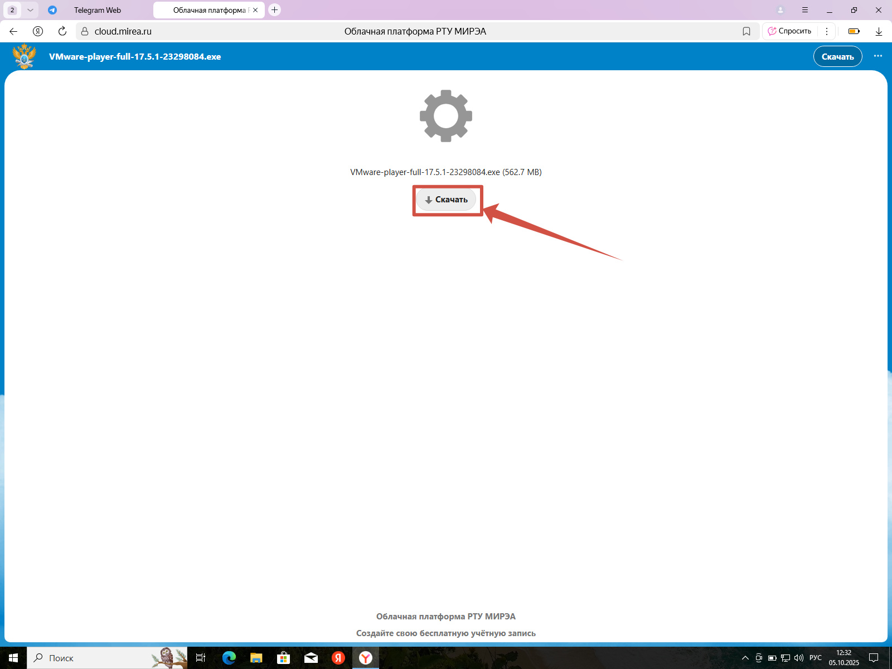

*Рисунок 1 — Куда нажать, чтобы скачать VMware*

Запустите скачанный файл. 

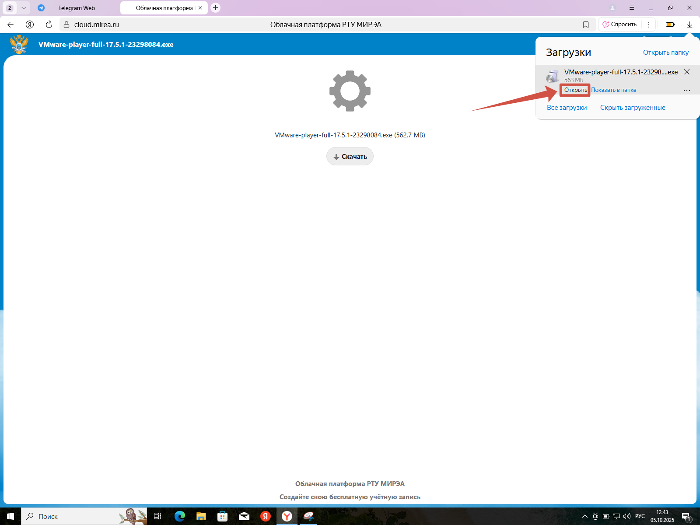

*Рисунок 2 — Куда нажать, чтобы установить VMware*

---

### Шаг 2. Устанавливаем VMware

Установка проходит в несколько простых шагов — просто следуйте подсказкам на экране. Ниже показан весь процесс по порядку:

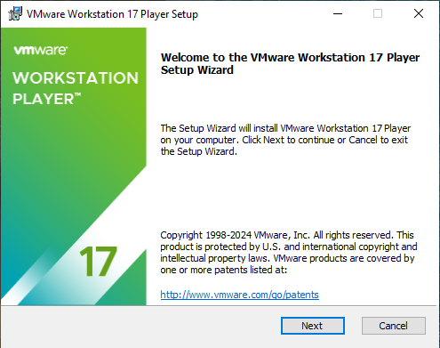

*Рисунок 3 — Установочное окно №1*

Принять лицензионное соглашение.  

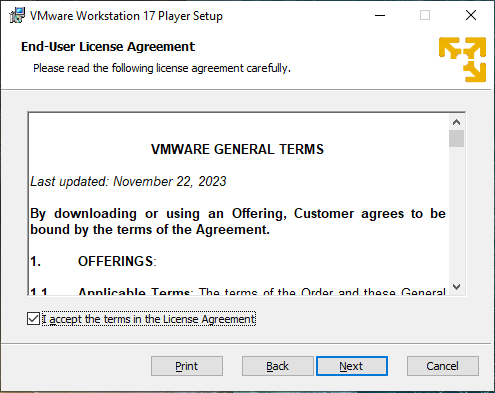

*Рисунок 4 — Установочное окно №2*

1 - пункт - элективный (Enhanced Keyboard Driver)  
2 - пункт - обязательный (Add VWware Workstation tools into PATH)  

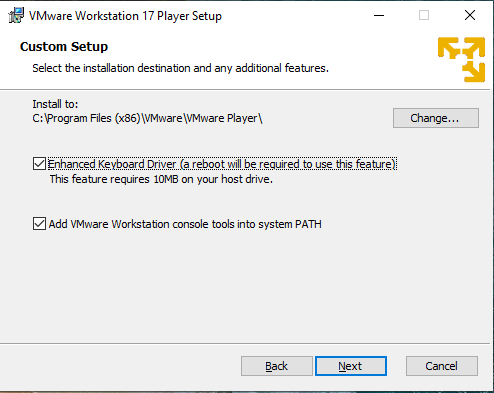

*Рисунок 5 — Установочное окно №3*

Выбор следующих пунктов — по желанию. 

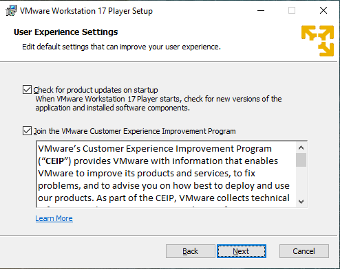

*Рисунок 6 — Установочное окно №4*

Выбор следующих пунктов — по желанию. 

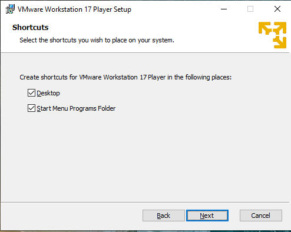

*Рисунок 7 — Установочное окно №5*

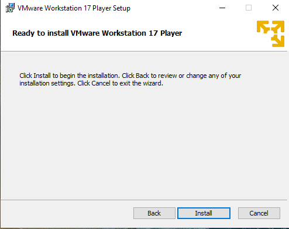

*Рисунок 8 — Установочное окно №6*

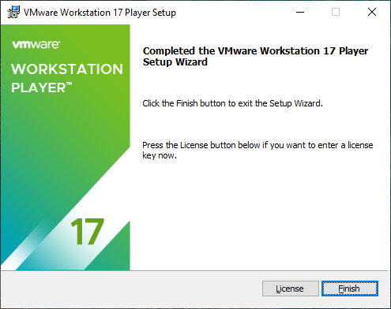

*Рисунок 9 — Установочное окно №7*

---

### Шаг 3. Подтверждаем установку сетевых компонентов

Если во время установки появится окно с вопросом о разрешении перезагрузки. Нажмите «Yes».

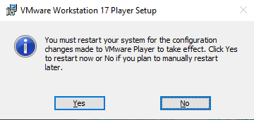

*Рисунок 10 — Установочное окно №8*

---

### Шаг 4. Запускаем VMware

После завершения установки на рабочем столе появится ярлык программы. Дважды кликните по нему, чтобы запустить VMware.

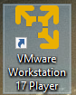

*Рисунок 11 — Иконка VMware*

Затем выберите настройки, как показано на изображении ниже:

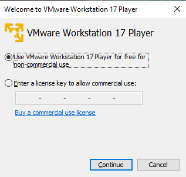

*Рисунок 12 — Выбор лицензии использования*

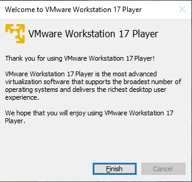

*Рисунок 13 — Приветственное окно*

---

### Готово! Вот как выглядит главный интерфейс VMware

Теперь вы видите основное окно программы. Здесь вы сможете создавать, запускать и управлять своими виртуальными машинами.

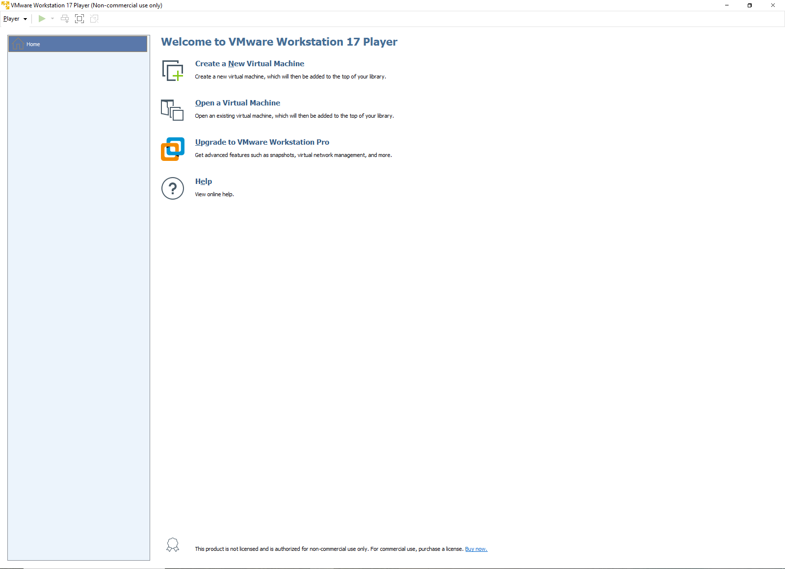

*Рисунок 14 — Интерфейс VMware*