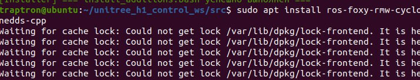
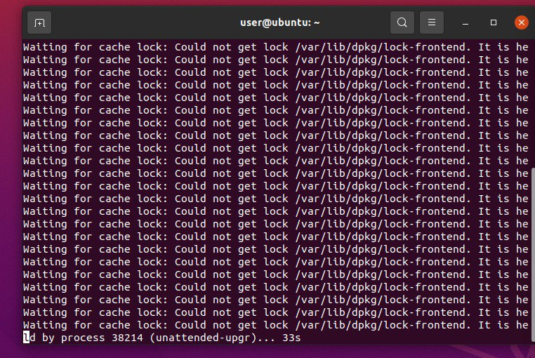

# **Trouble shooting и часто задаваемые вопросы**

В данной заметке будут находиться вопросы, которые чаще всего возникают при работе с роботом а также hot-fix решения.

## Невозможность установить/обновить пакет(ы)
### Суть проблемы 

При запуске одной из команд, которые представлены ниже, возникает ошибка доступа к служебному файлу и пакетный менеджер `apt` уходит в режим ожидания, 'пингуя' недоступный файл .

```bash
sudo apt update
sudo apt upgrade
sudo apt install <package name>
```

### Как выглядит проблема в терминале





### Решение
Просто подождите. Чаще всего это значит, что процесс обновления уже запущен (самой системой) и работает в фоне. Подождите 2-5 минут и попробуйте снова.