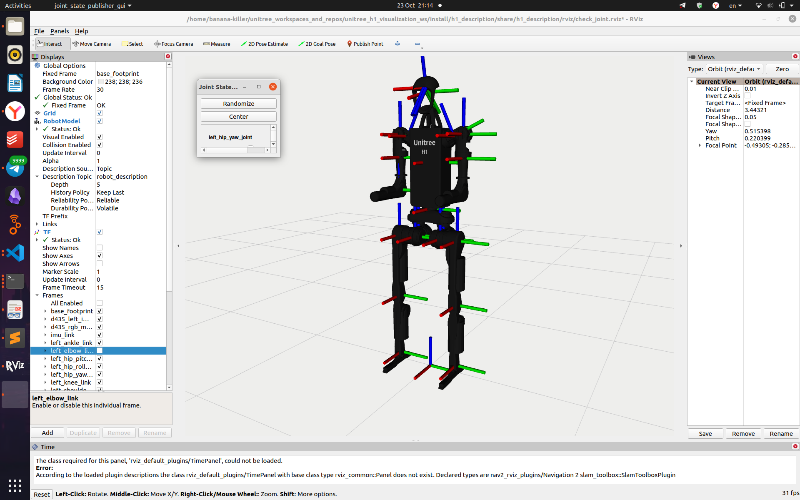
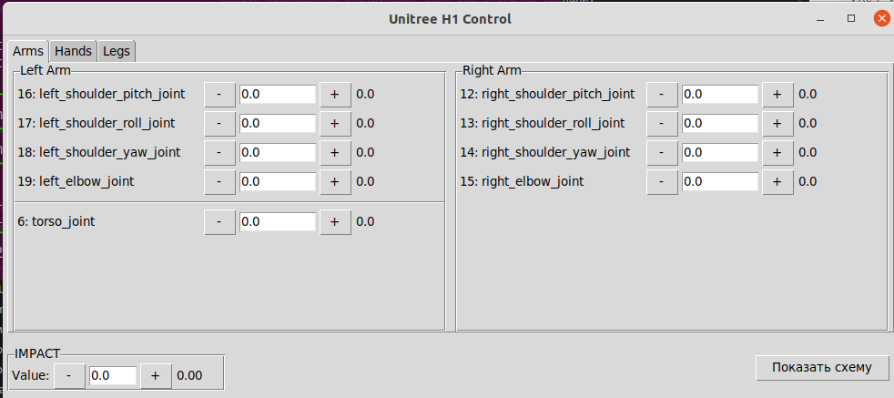

# Ограничения по  значениям принимаемых углов для каждого суства

**Эти ограничения указаны в [оффициальной документации от Unitree](https://support.unitree.com/home/en/developer).**

# Определение направления осей
Когда все шарниры находятся в нулевом положении, система координат выглядит так, как показано на следующем рисунке. Красная ось обозначает ось X, зелёная — ось Y, а синяя — ось Z.


*Рисунок 1 - Оси кооррдинат, когда шарниры находятся в нулевом положении*

## Опционально:

Вы также можете посмотреть эту визуализацию вживую и поэкспериментировать с моделью робота в Rviz. Для этого необходимо:

1.  **Установите Rviz** (обычно входит в состав ROS2).
2.  **Установите и соберите необходимые репозитории:**
    *   [`unitree_h1_visualization_ws`](https://github.com/cyberbanana777/unitree_h1_visualization_ws) — следуя приложенной инструкции.
    *   [`unitree_h1_control_ws`](https://github.com/cyberbanana777/unitree_h1_control_ws) — если он ещё не установлен.

При установке зависимотей скриптом (3 шаг в `unitree_h1_visualization_ws`) смотрите на вывод скрипта в терминале, иногда нужно запустить его из-под sudo.
Это значит написать перед текстом команды sudo и запустить, а потом ввести пароль.

3.  **Запустите систему.**

Сначала запустите launch-файл для визуализации модели робота:
```bash
ros2 launch completed_scripts_visualization show.launch.py mode:=without_hands launch_rviz:=True robot:=simulation
```



*Рисунок 2 - Робот в rviz*

- Красная ось обозначает ось X, зелёная — ось Y, а синяя — ось Z.
- Show Axes - покажет оси.
- Frames - можно включить или выключить отображение определенных осей.

Затем, в отдельном терминале, запустите ноду для отправки управляющих сигналов, чтобы задавать движение модели:
```bash
ros2 run low_level_control low_level_control_without_hands_node
```

### Дополнительная возможность: Графический интерфейс

Для упрощённого задания углов суставов вы можете дополнительно запустить [графический интерфейс](https://github.com/cyberbanana777/unitree_h1_control_ws?tab=readme-ov-file#gui_control) `gui_control_node`.

```bash
ros2 run gui_control gui_control_node
```

> **Примечание:** Если репозиторий `unitree_h1_control_ws` уже установлен, для запуска графического интерфейса больше ничего не требуется.



*Рисунок 3 - Графический интерфейс для управления роботом*

> Можно вводть координаты в поле с клавиатуры или изменять кнопками "+" и "-".

# Определение направления вращения для каждого звена в зависимости от поданного на мотор значения (угла)

Если выполнить инструкцию из опционального раздела предыдущего пункта, вы сможете управлять роботом через графический интерфейс в rviz и наблюдать, в какую сторону будет вращаться каждое звено.

В общем случае, можно реализовать то же самое в MuJoCo. Для этого:

1. **Установите MuJoCo** по инструкции `5_Как_установить_Mujoco_вместе_с_моделями_Unitree.md`
2. **Запустите симуляцию** - в правой части окна визуализатора вы найдете раскрывающееся поле **Control**
3. **Экспериментируйте** - через этот интерфейс можно независимо управлять каждым мотором и визуально определять положительное/отрицательное направление вращения.


*Рисунок 4 - Управление моторами в mujoco*

# Анализ URDF: расположения и наклоны link относительно друг друга


*Рисунок 5 - Суставы Unitre H1*

## Общая структура описания звена и его

### 1. Звено (Link `<link>`)
**Тег `<link> `описывает жесткий сегмент робота, его физические и визуальные свойства. У каждого звена должно быть уникальное имя (name).**

Компоненты внутри `<link>`:
`<inertial>` (Инерционные параметры): Определяет массу и момент инерции звена. Критически важно для точного физического моделирования в симуляторах (например, Gazebo).

`<origin>`: Задает смещение и поворот центра инерции (Center of Mass) относительно геометрического центра звена.

`<mass>`: Масса звена в килограммах.

`<inertia>`: Тензор инерции, представляющий собой симметричную матрицу 3x3. Он описывает, как масса распределена вокруг осей координат. Параметры ixx, iyy, izz — это моменты инерции, а ixy, ixz, iyz — произведения инерции.

`<visual>` (Визуальное представление): Описывает, как звено выглядит в инструментах визуализации (таких как RVIZ2).

`<origin>`: Смещение и поворот визуальной геометрии относительно центра звена.

`<geometry>`: Определяет форму. Это может быть `<box>`, `<cylinder>`, `<sphere>`, или сложная <mesh> (обычно файл в формате .dae или .stl).

`<material>`: Определяет цвет (`<color>`) или текстуру звена.

`<collision>` (Коллизионная геометрия): Описывает форму, используемую движком физики для расчета столкновений. Эта геометрия часто бывает более простой, чем визуальная, для повышения производительности.

`<origin>`: Смещение и поворот коллизионной геометрии.

`<geometry>`: Форма для столкновений (аналогично визуальной).

Важно: Визуальная и коллизионная геометрии не обязаны совпадать. Упрощение коллизионной модели — стандартная практика.

### 2. Соединение (Joint `<joint>`)
**Тег `<joint>` описывает, как два звена связаны друг с другом, и определяет тип их относительного движения.**

Атрибуты и компоненты внутри `<joint>`:

- `name`: Уникальное имя соединения.

- `type`: Тип соединения, определяющий степени свободы:

  - `revolute` - вращательное соединение (с ограниченным углом).

  - `continuous` - вращательное соединение (без ограничений, как колесо).

  - `prismatic` - линейное (поступательное) соединение.

  - `fixed` - жесткое соединение (без движения).

  - `floating` - соединение с полной свободой движения.

  - `planar` - движение в плоскости.

**`<origin>`: Задает смещение и поворот от системы координат родительского звена к системе координат дочернего звена. Это преобразование, которое помещает дочернее звено в пространстве относительно родителя.**

#### Атрибут `xyz` - перемещение (translation)
- **Формат:** `"x y z"` в метрах
- **Значения:** `"0 0 0"`
- **Расшифровка:**
  - `x=0` - смещения по оси X (вперед/назад)
  - `y=0` - смещения по оси Y (влево/вправо) 
  - `z=0` - смещение по оси Z (вверх/вниз)

#### Атрибут `rpy` - поворот (rotation)
- **Формат:** `"roll pitch yaw"` в радианах
- **Значения:** `"0 0 0"`
- **Расшифровка:**
  - `roll=0` - крен (вращение вокруг оси X)
  - `pitch=0` - тангаж (вращение вокруг оси Y)
  - `yaw=0` - рысканье (вращение вокруг оси Z)

`<parent>`: Ссылка на родительское звено (link) в иерархии робота.

`<child>`: Ссылка на дочернее звено, которое присоединяется к родительскому.

`<axis>`: Определяет ось, вокруг которой (или вдоль которой) происходит движение. Задается единичным вектором в локальных координатах соединения. Например, xyz="1 0 0" означает ось X.

`<limit>`: Обязателен для соединений типа revolute и prismatic. Определяет рабочий диапазон соединения.

- `lower` - нижний предел (в радианах или метрах).

- `upper` - верхний предел.

- `effort` - максимальное усилие (крутящий момент для revolute или сила для prismatic), которое может приложить привод.

- `velocity` - максимальная скорость движения.

## Разбор примера левого голеностопного сустава

Нужно описание лажит по этому относительному адресу:

`unitree_h1_visualization_ws/src/h1_description/urdf/h1.urdf`

или по [этой ссылке](https://github.com/cyberbanana777/unitree_h1_visualization_ws/blob/main/h1_description/urdf/h1.urdf) в репоизитории `unitree_h1_visualization_ws`.

Рассмотрим левого голеностопного сустава, описанное в URDF,:

```bash

    <link
    name="left_ankle_link">
    <inertial>
        <origin
        xyz="0.042575 -0.000001 -0.044672"
        rpy="0 0 0" />
        <mass
        value="0.474" />
        <inertia
        ixx="0.000159668"
        ixy="-0.000000005"
        ixz="0.000141063"
        iyy="0.002900286"
        iyz="0.000000014"
        izz="0.002805438" />
    </inertial>
    <visual>
        <origin
        xyz="0 0 0"
        rpy="0 0 0" />
        <geometry>
        <mesh
            filename="package://h1_description/meshes/left_ankle_link.dae" />
        </geometry>
        <material
        name="">
        <color
            rgba="0.1 0.1 0.1 1" />
        </material>
    </visual>
    <collision>
        <origin xyz="0.05 0.0 -0.05" rpy="0 0 0" />
        <geometry>
        <box size="0.28 0.03 0.024"/>
        </geometry>
    </collision>
    </link>
    <joint
    name="left_ankle_joint"
    type="revolute">
    <origin
        xyz="0 0 -0.4"
        rpy="0 0 0" />
    <parent
        link="left_knee_link" />
    <child
        link="left_ankle_link" />
    <axis
        xyz="0 1 0" />
    <limit
        lower="-0.87"
        upper="0.52"
        effort="40"
        velocity="9" />
    </joint>

```

## Общая структура иерархии
Робот в URDF представляется в виде дерева звеньев, соединенных суставами. Начинается дерево с "корневого" звена (base link), которое не имеет родителя. Каждое последующее звено присоединяется к уже существующему в дереве с помощью сустава.

В вашем примере:

`left_knee_link` является родителем.

`left_ankle_link` является ребенком.

`left_ankle_joint` определяет, как именно ребенок соединен с родителем (включая смещение, ориентацию и ось вращения).


## Блок Соединения (Joint) - `left_ankle_joint`

Для определения нужных нам параматров достаточно расмотреть блок `<joint>`.

### Основные параметры соединения
```xml
<joint name="left_ankle_joint" type="revolute">
```

**Что это значит:**
- `name="left_ankle_joint"` - уникальное имя соединения
- `type="revolute"` - вращательный тип соединения (как шарнир)

### Геометрия соединения
```xml
<origin xyz="0 0 -0.4" rpy="0 0 0" />
```

**Что это значит:**
- Соединение расположено со смещением **-0.4 м (40 см)** по оси Z относительно родительского звена
- Это означает, что голеностоп находится на 40 см ниже коленного сустава
- И голеностоп не повернут ни по какой оси относительно коленного сустава

### Иерархия соединений
```xml
<parent link="left_knee_link" />
<child link="left_ankle_link" />
```

**Что это значит:**
- Родительское звено: `left_knee_link` (звено колена)
- Дочернее звено: `left_ankle_link` (текущее звено лодыжки)

### Ось вращения и ограничения
```xml
<axis xyz="0 1 0" />
<limit lower="-0.87" upper="0.52" effort="40" velocity="9" />
```

**Что это значит:**
- `<axis xyz="0 1 0">` - ось вращения направлена по оси Y
- `<limit>`:
  - `lower="-0.87"` - минимальный угол = **-0.87 радиан** (≈ -50°)
  - `upper="0.52"` - максимальный угол = **0.52 радиан** (≈ +30°)
  - `effort="40"` - максимальный крутящий момент = **40 Н·м**
  - `velocity="9"` - максимальная скорость = **9 рад/с** (≈ 515°/с)

## Физический смысл всей конструкции

Это описание **голеностопного сустава** робота:
- Звено представляет собой часть ноги в области лодыжки
- Соединение позволяет совершать движения типа "сгибание-разгибание" стопы
- Ограничения угла позволяют двигаться от подъема стопы (50°) до опускания (30°)

# Анализ URDF: длины звеньев

Проанализируем `right_hip_pitch_joint` из `urdf`:

```bash

<!-- right_hip_roll → right_hip_pitch -->
  <joint
    name="right_hip_pitch_joint"
    type="revolute">
    <origin
      xyz="0 -0.11536 0"
      rpy="0 0 0" />
    <parent
      link="right_hip_roll_link" />
    <child
      link="right_hip_pitch_link" />
    <axis
      xyz="0 1 0" />
    <limit
      lower="-3.14"
      upper="2.53"
      effort="200"
      velocity="23" />
  </joint>

```


*Рисунок 6 - Система координат right_hip_roll_link (справа) и right_hip_pitch_link (слева)*

**Расчёт длины звена**

В данном случае длина звена равна расстоянию между центрами систем координат `right_hip_roll_link` и `right_hip_pitch_link`.

Смещение между ними задано вектором `xyz="0 -0.11536 0"`. Поскольку смещение присутствует только по оси Y, длина звена рассчитывается просто как модуль этого значения:

Длина = | -0.11536 | = 0.11536 метра.

**В общем случае, если бы смещение было по нескольким осям, длина находилась бы по формуле √(x² + y² + z²).**


# Как преобразовать координаты между различными фреймами робота


---

# Детальный разбор тега `<origin>` в URDF

## Полная структура тега
```xml
<origin xyz="0 0 -0.4" rpy="0 0 0" />
```

## 1. Компоненты тега

### Атрибут `xyz` - перемещение (translation)
- **Формат:** `"x y z"` в метрах
- **Значения:** `"0 0 -0.4"`
- **Расшифровка:**
  - `x=0` - нет смещения по оси X (вперед/назад)
  - `y=0` - нет смещения по оси Y (влево/вправо) 
  - `z=-0.4` - смещение на **0.4 метра (40 см) вниз** по оси Z

### Атрибут `rpy` - поворот (rotation)
- **Формат:** `"roll pitch yaw"` в радианах
- **Значения:** `"0 0 0"`
- **Расшифровка:**
  - `roll=0` - нет крена (вращение вокруг оси X)
  - `pitch=0` - нет тангажа (вращение вокруг оси Y)
  - `yaw=0` - нет рыскания (вращение вокруг оси Z)

## 2. Математическая интерпретация

### Преобразование координат
Тег `<origin>` создает однородную матрицу преобразования 4×4:

```
[ 1  0  0  0 ]   # Поворот (R)
[ 0  1  0  0 ]   # R = Identity matrix (т.к. rpy="0 0 0")
[ 0  0  1 -0.4]  # Смещение (t) = [0, 0, -0.4]ᵀ
[ 0  0  0  1  ]
```

### Уравнение преобразования
```
P_child = R × P_parent + t
```
где:
- `P_parent` - точка в системе координат родителя
- `P_child` - та же точка в системе координат ребенка
- `R` - матрица поворота (единичная в данном случае)
- `t` - вектор смещения [0, 0, -0.4]ᵀ

## 3. Контекст применения

### В блоке `<joint>` (как в примере)
```xml
<joint name="left_ankle_joint">
  <origin xyz="0 0 -0.4" rpy="0 0 0" />
  <parent link="left_knee_link" />
  <child link="left_ankle_link" />
</joint>
```

**Физический смысл:**
- Система координат дочернего звена (`left_ankle_link`) смещена на 40 см вниз относительно системы координат родительского звена (`left_knee_link`)
- Оси координат остаются параллельными (нет поворота)
- Это типично для суставов ног роботов, где звенья расположены вертикально друг под другом

### В блоках `<inertial>`, `<visual>`, `<collision>`
В этих контекстах `<origin>` определяет смещение относительно центра звена:

```xml
<inertial>
  <origin xyz="0.042575 -0.000001 -0.044672" rpy="0 0 0" />
  <!-- Центр масс смещен относительно геометрического центра -->
</inertial>
```

## 4. Системы координат и преобразования

### Правило правой руки
- **Ось X** - красная, направлена вперед
- **Ось Y** - зеленая, направлена влево  
- **Ось Z** - синяя, направлена вверх

### Порядок преобразований
При применении `<origin>`:
1. Сначала применяется поворот (rpy)
2. Затем применяется смещение (xyz)

## 5. Практические примеры значений

### Типичные смещения в робототехнике:
```xml
<!-- Вертикальное смещение (ноги, манипуляторы) -->
<origin xyz="0 0 -0.4" rpy="0 0 0" />

<!-- Горизонтальное смещение -->
<origin xyz="0.2 0 0" rpy="0 0 0" />

<!-- Диагональное смещение -->
<origin xyz="0.1 0.05 -0.3" rpy="0 0 0" />
```

### Типичные повороты:
```xml
<!-- Поворот на 90° вокруг оси Y -->
<origin xyz="0 0 0" rpy="0 1.5708 0" />

<!-- Поворот на 45° вокруг оси Z -->
<origin xyz="0 0 0" rpy="0 0 0.7854" />

<!-- Комбинированное преобразование -->
<origin xyz="0.1 0 0.2" rpy="0 0 1.0472" />
```

