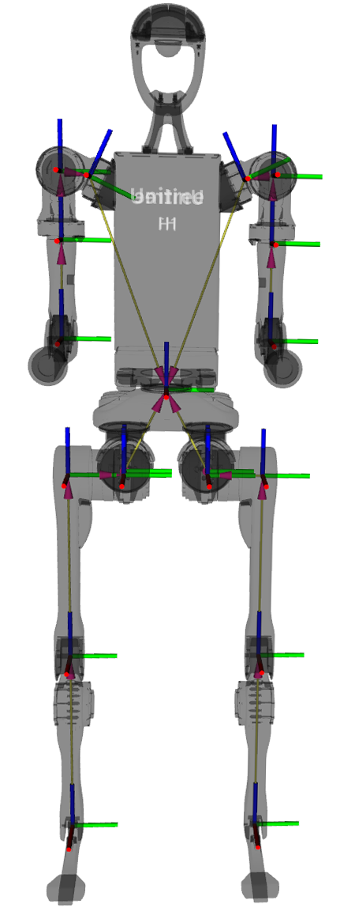
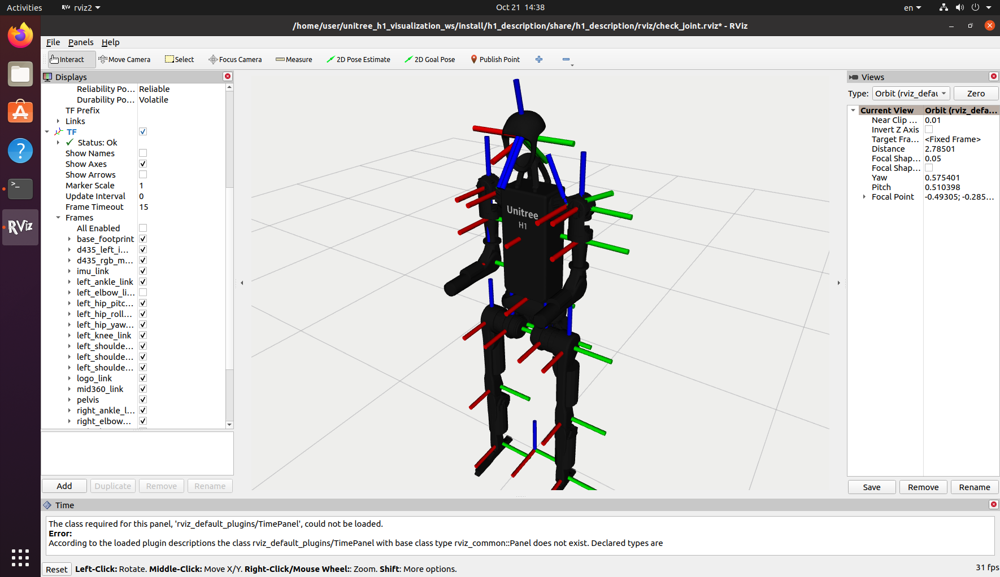
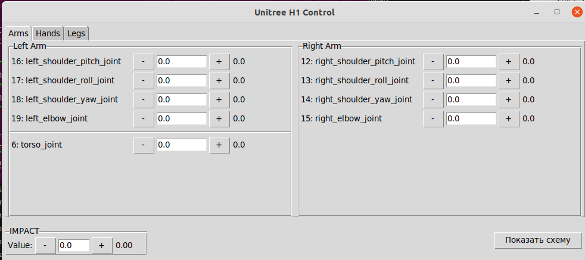
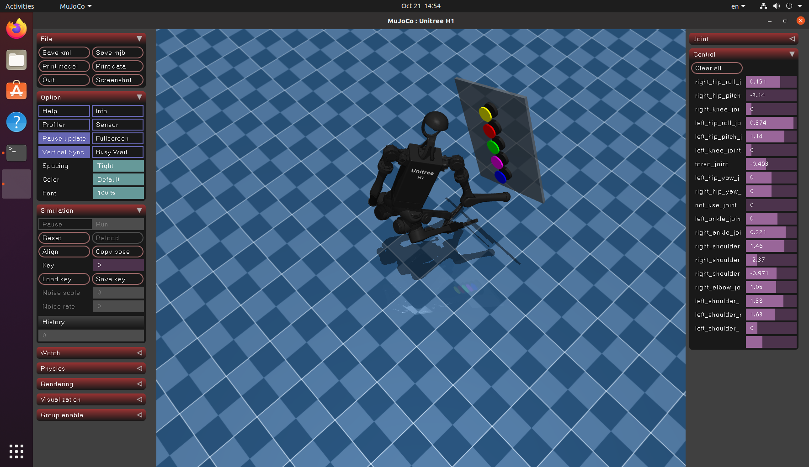

# Определение направления осей

Когда все шарниры находятся в нулевом положении, система координат выглядит так, как показано на следующем рисунке. Красная ось обозначает ось X, зелёная — ось Y, а синяя — ось Z. Изображение взято из **[официальной документации Unitree](https://support.unitree.com/home/en/developer).**



*Рисунок 1 — Оси координат, когда шарниры находятся в нулевом положении*

## Опционально:

Вы также можете посмотреть эту визуализацию вживую и поэкспериментировать с моделью робота в Rviz. Для этого необходимо:

1. **Установите Rviz** (обычно входит в состав ROS2).
2. **Установите и соберите необходимые репозитории:**
   - [`unitree_h1_visualization_ws`](https://github.com/cyberbanana777/unitree_h1_visualization_ws) — следуя приложенной инструкции.
   - [`unitree_h1_control_ws`](https://github.com/cyberbanana777/unitree_h1_control_ws) — если он ещё не установлен.

При установке зависимостей скриптом (шаг 3 в `unitree_h1_visualization_ws`) следите за выводом скрипта в терминале — иногда его нужно запускать с помощью `sudo`. Для этого напишите перед командой `sudo` и введите пароль при запросе:

```bash
sudo <ваша_команда>
```

3. **Запустите систему.**

Сначала запустите launch-файл для визуализации модели робота:

```bash
ros2 launch completed_scripts_visualization show.launch.py mode:=without_hands launch_rviz:=True robot:=simulation
```



*Рисунок 2 — Робот в Rviz. Красная ось обозначает ось X, зелёная — ось Y, а синяя — ось Z*

В блоке TF:
- Пункт `Show Axes` — позволяет включить или отключить отображение всех осей.
- В разделе `Frames` — можно включить или отключить отображение определённых осей.

Затем в отдельном терминале запустите ноду для отправки управляющих сигналов, чтобы задавать движение модели:

```bash
ros2 run low_level_control low_level_control_without_hands_node
```

Инструкцию по отправке управляющих сигналов на робота смотрите в методическом материале №7, названном соответствующим образом.

### Дополнительная возможность: Графический интерфейс

Для упрощённого задания углов суставов (отправки управляющих сигналов) вы можете дополнительно запустить [графический интерфейс](https://github.com/cyberbanana777/unitree_h1_control_ws?tab=readme-ov-file#gui_control) `gui_control_node`, который идёт в комплекте с репозиторием `unitree_h1_control_ws`.

```bash
ros2 run gui_control gui_control_node
```

> **Примечание:** Если репозиторий `unitree_h1_control_ws` уже полностью установлен по инструкции из репозитория, то для запуска графического интерфейса достаточно выполнить команду выше.



*Рисунок 3 — Графический интерфейс для управления роботом*

> Можно вводить координаты в поле с клавиатуры или изменять их кнопками «+» и «–».

# Определение направления вращения для каждого звена в зависимости от поданного на мотор значения (угла)

Если выполнить инструкцию из опционального раздела предыдущего пункта, вы сможете управлять роботом через графический интерфейс в Rviz и наблюдать, в какую сторону будет вращаться каждое звено.

В общем случае можно реализовать то же самое в MuJoCo. Для этого:

1. **Установите MuJoCo** по инструкции [5_Как_установить_Mujoco_вместе_с_моделями_Unitree](https://github.com/cyberbanana777/unitree_h1_docs/blob/main/instructions_and_manuals/5_Как_установить_Mujoco_вместе_с_моделями_Unitree.md).
2. **Запустите симуляцию** — в правой части окна визуализатора вы найдёте раскрывающееся поле **Control**.
3. **Экспериментируйте** — через этот интерфейс можно независимо управлять каждым мотором и визуально определять положительное/отрицательное направление вращения.



*Рисунок 4 — Управление моторами в MuJoCo*