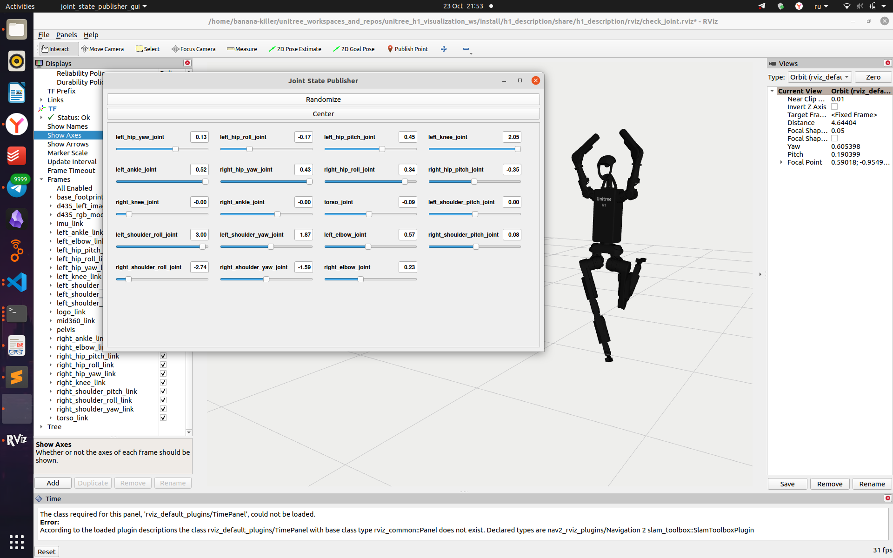

# Определение направления осей

Когда все шарниры находятся в нулевом положении, система координат выглядит так, как показано на следующем рисунке. Красная ось обозначает ось X, зелёная — ось Y, а синяя — ось Z. Изображение взято из **[официальной документации Unitree](https://support.unitree.com/home/en/H1_developer).**


*Рисунок 1 — Оси координат, когда шарниры находятся в нулевом положении*

## Опционально:

Вы также можете посмотреть эту визуализацию вживую и поэкспериментировать с моделью робота в Rviz. Для этого необходимо:

1. **Установите Rviz** (обычно входит в состав ROS2).
2. **Установите и соберите репозиторий** [`unitree_h1_visualization_ws`](https://github.com/cyberbanana777/unitree_h1_visualization_ws) — следуя приложенной инструкции.

3. **Запустите систему.**

Запустите launch-файл для визуализации модели робота и графического интерфейса для управления положением суставов:

```bash
ros2 launch completed_scripts_visualization show.launch.py mode:=without_hands launch_rviz:=True robot:=empty launch_control_by_gui:=True
```


*Рисунок 2 — Робот в Rviz. Красная ось обозначает ось X, зелёная — ось Y, а синяя — ось Z*

В блоке TF:
- Пункт `Show Axes` — позволяет включить или отключить отображение всех осей.
- В разделе `Frames` — можно включить или отключить отображение определённых осей.

Растяните окно `Joint State Publisher`, что бы увидеть все ползунки. Передвигая полузнки, управляйте углами в суставах робота.



*Рисунок 3 — Управление углами в суставах робота в Rviz с помощью gui интерфейса*

### Дополнительная возможность: управлние реальным роботом с помощью графического интерфейса

Для управления роботом с помощью графического интерфейса ознакомьтесь с методическими указаниями [7_Как_отправить_управляющий_сигнал_на_робота](https://github.com/cyberbanana777/unitree_h1_docs/blob/main/instructions_and_manuals/7_Как_отправить_управляющий_сигнал_на_робота.md). Установите и собрите репозиторий [unitree_h1_control_ws](https://github.com/cyberbanana777/unitree_h1_control_ws) — следуя приложенной инструкции, если еще этого не сделали.

Затем в отдельном терминале запустите ноду для отправки управляющих сигналов, чтобы задавать движение роботу:

```bash
ros2 run low_level_control low_level_control_without_hands_node
# (по умолчанию target_topic_param = "arm_sdk")
```

Запустите графический интерфейс `gui_control_node`:


```bash
ros2 run gui_control gui_control_node
```

Эта нода публикует в топик `/position_to_unitree`. Подробнее смотрите здесь [gui_control_node](https://github.com/cyberbanana777/unitree_h1_control_ws?tab=readme-ov-file#gui_control).


*Рисунок 4 — Графический интерфейс для управления роботом*

> Можно вводить координаты в поле с клавиатуры или изменять их кнопками «+» и «–».

# Определение направления вращения для каждого звена в зависимости от поданного на мотор значения (угла)

Если выполнить инструкцию из опционального раздела предыдущего пункта, вы сможете управлять роботом через графический интерфейс в Rviz и наблюдать, в какую сторону будет вращаться каждое звено.

В общем случае можно реализовать то же самое в MuJoCo. Для этого:

1. **Установите MuJoCo** по инструкции [5_Как_установить_Mujoco_вместе_с_моделями_Unitree](https://github.com/cyberbanana777/unitree_h1_docs/blob/main/instructions_and_manuals/5_Как_установить_Mujoco_вместе_с_моделями_Unitree.md).
2. **Запустите симуляцию** — в правой части окна визуализатора вы найдёте раскрывающееся поле **Control**.
3. **Экспериментируйте** — через этот интерфейс можно независимо управлять каждым мотором и визуально определять положительное/отрицательное направление вращения.


*Рисунок 5 — Управление моторами в MuJoCo*