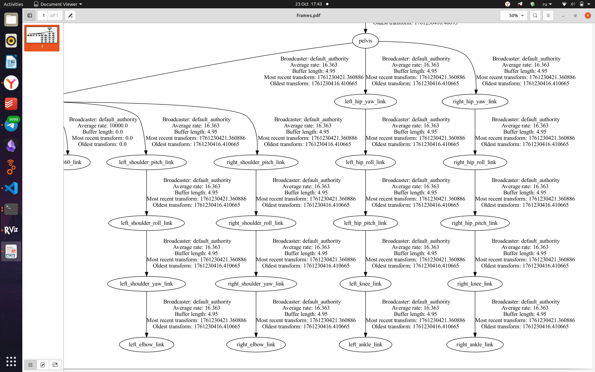
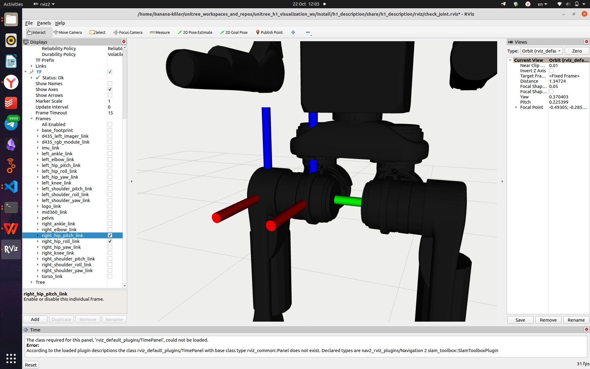

# Анализ URDF: расположение и наклоны joints относительно друг друга, длины звеньев

## Общая структура описания звена и его фрейма

Фрейм — это система координат. Каждый link в ROS2 автоматически становится фреймом, связанным жестко с частью робота. Также существуют фреймы, не связанные с роботом, например, `base_footprint` — в нашем случае это проекция таза (pelvis) на плоскость, на которой стоит робот.

### 1. Звено (Link `<link>`)
**Тег `<link>` описывает жесткий сегмент робота, его физические и визуальные свойства. У каждого звена должно быть уникальное имя (name).**

**Компоненты внутри `<link>`:**

- **`<inertial>` (Инерционные параметры):** Определяет массу и момент инерции звена. Критически важно для точного физического моделирования в симуляторах (например, Gazebo).
  - **`<origin>`:** Задает смещение и поворот центра инерции (Center of Mass) относительно геометрического центра звена.
  - **`<mass>`:** Масса звена в килограммах.
  - **`<inertia>`:** Тензор инерции, представляющий собой симметричную матрицу 3x3. Он описывает, как масса распределена вокруг осей координат. Параметры `ixx`, `iyy`, `izz` — это моменты инерции, а `ixy`, `ixz`, `iyz` — произведения инерции.

- **`<visual>` (Визуальное представление):** Описывает, как звено выглядит в инструментах визуализации (таких как RVIZ2).
  - **`<origin>`:** Смещение и поворот визуальной геометрии относительно центра звена.
  - **`<geometry>`:** Определяет форму. Это может быть `<box>`, `<cylinder>`, `<sphere>` или сложная `<mesh>` (обычно файл в формате .dae или .stl).
  - **`<material>`:** Определяет цвет (`<color>`) или текстуру звена.

- **`<collision>` (Коллизионная геометрия):** Описывает форму, используемую движком физики для расчета столкновений. Эта геометрия часто бывает более простой, чем визуальная, для повышения производительности.
  - **`<origin>`:** Смещение и поворот коллизионной геометрии.
  - **`<geometry>`:** Форма для столкновений (аналогично визуальной).

> **Важно:** Визуальная и коллизионная геометрии не обязаны совпадать. Упрощение коллизионной модели — стандартная практика.

### 2. Соединение (Joint `<joint>`)
**Тег `<joint>` описывает, как два звена связаны друг с другом, и определяет тип их относительного движения.**

**Атрибуты и компоненты внутри `<joint>`:**

- **`name`:** Уникальное имя соединения.
- **`type`:** Тип соединения, определяющий степени свободы:
  - `revolute` — вращательное соединение (с ограниченным углом).
  - `continuous` — вращательное соединение (без ограничений, как колесо).
  - `prismatic` — линейное (поступательное) соединение.
  - `fixed` — жесткое соединение (без движения).
  - `floating` — соединение с полной свободой движения.
  - `planar` — движение в плоскости.

- **`<origin>`:** Задает смещение и поворот от системы координат родительского звена к системе координат дочернего звена. Это преобразование, которое помещает дочернее звено в пространстве относительно родителя.

#### Атрибут `xyz` — перемещение (translation)
- **Формат:** `"x y z"` в метрах
- **Значения по умолчанию:** `"0 0 0"`
- **Расшифровка:**
  - `x` — смещение по оси X (вперед/назад)
  - `y` — смещение по оси Y (влево/вправо)
  - `z` — смещение по оси Z (вверх/вниз)

#### Атрибут `rpy` — поворот (rotation)
- **Формат:** `"roll pitch yaw"` в радианах
- **Значения по умолчанию:** `"0 0 0"`
- **Расшифровка:**
  - `roll` — крен (вращение вокруг оси X)
  - `pitch` — тангаж (вращение вокруг оси Y)
  - `yaw` — рыскание (вращение вокруг оси Z)

- **`<parent>`:** Ссылка на родительское звено (link) в иерархии робота.
- **`<child>`:** Ссылка на дочернее звено, которое присоединяется к родительскому.
- **`<axis>`:** Определяет ось, вокруг которой (или вдоль которой) происходит движение. Задается единичным вектором в локальных координатах соединения. Например, `xyz="1 0 0"` означает ось X.
- **`<limit>`:** Обязателен для соединений типа `revolute` и `prismatic`. Определяет рабочий диапазон соединения.
  - `lower` — нижний предел (в радианах или метрах).
  - `upper` — верхний предел.
  - `effort` — максимальное усилие (крутящий момент для `revolute` или сила для `prismatic`), которое может приложить привод.
  - `velocity` — максимальная скорость движения.

## Разбор примера левого голеностопного сустава

URDF-описание лежит по относительному адресу:

`unitree_h1_visualization_ws/src/h1_description/urdf/h1.urdf`

или по [этой ссылке](https://github.com/cyberbanana777/unitree_h1_visualization_ws/blob/main/h1_description/urdf/h1.urdf) в репозитории `unitree_h1_visualization_ws`.

Рассмотрим левый голеностопный сустав, описанный в `h1.urdf`:

```xml
<link name="left_ankle_link">
    <inertial>
        <origin xyz="0.042575 -0.000001 -0.044672" rpy="0 0 0" />
        <mass value="0.474" />
        <inertia
            ixx="0.000159668"
            ixy="-0.000000005"
            ixz="0.000141063"
            iyy="0.002900286"
            iyz="0.000000014"
            izz="0.002805438" />
    </inertial>
    <visual>
        <origin xyz="0 0 0" rpy="0 0 0" />
        <geometry>
            <mesh filename="package://h1_description/meshes/left_ankle_link.dae" />
        </geometry>
        <material name="">
            <color rgba="0.1 0.1 0.1 1" />
        </material>
    </visual>
    <collision>
        <origin xyz="0.05 0.0 -0.05" rpy="0 0 0" />
        <geometry>
            <box size="0.28 0.03 0.024"/>
        </geometry>
    </collision>
</link>

<joint name="left_ankle_joint" type="revolute">
    <origin xyz="0 0 -0.4" rpy="0 0 0" />
    <parent link="left_knee_link" />
    <child link="left_ankle_link" />
    <axis xyz="0 1 0" />
    <limit
        lower="-0.87"
        upper="0.52"
        effort="40"
        velocity="9" />
</joint>
```

## Общая структура иерархии

Робот в URDF представляется в виде дерева звеньев, соединенных суставами. Дерево начинается с "корневого" звена (base link), которое не имеет родителя. Каждое последующее звено присоединяется к уже существующему в дереве с помощью сустава.

Посмотреть дерево соединений можно командой (если происходит публикация TF-преобразований т.е. публикуются сообщения в /tf топики — см. [методический материал 14](https://github.com/cyberbanana777/unitree_h1_docs/blob/main/instructions_and_manuals/14_Как_преобразовать_координаты_точки_из_сис_кор_одного_joint_сис_кор_другого.md)):

```bash
ros2 run tf2_tools view_frames.py
```

Эта команда генерирует PDF-файл с отображением всех звеньев и соединений в виде дерева.

Команда для открытия файла в системе Linux:

```bash
xdg-open frames.pdf
```



*Рисунок 5 — Дерево TF-преобразований*

В нашем примере:

- `left_knee_link` является родителем.
- `left_ankle_link` является ребенком.
- `left_ankle_joint` определяет, как именно ребенок соединен с родителем (включая смещение, ориентацию и ось вращения).

## Блок соединения (Joint) — `left_ankle_joint`

Для определения нужных параметров достаточно рассмотреть блок `<joint>`.

### Основные параметры соединения

```xml
<joint name="left_ankle_joint" type="revolute">
```

**Что это значит:**
- `name="left_ankle_joint"` — уникальное имя соединения.
- `type="revolute"` — вращательный тип соединения (как шарнир).

### Геометрия соединения

```xml
<origin xyz="0 0 -0.4" rpy="0 0 0" />
```

**Что это значит:**
- Соединение расположено со смещением **-0.4 м (40 см)** по оси Z относительно родительского звена.
- Это означает, что голеностоп находится на 40 см ниже коленного сустава.
- Голеностоп не повернут ни по одной из осей относительно коленного сустава.

### Иерархия соединений

```xml
<parent link="left_knee_link" />
<child link="left_ankle_link" />
```

**Что это значит:**
- Родительское звено: `left_knee_link` (звено колена).
- Дочернее звено: `left_ankle_link` (звено лодыжки).

### Ось вращения и ограничения

```xml
<axis xyz="0 1 0" />
<limit lower="-0.87" upper="0.52" effort="40" velocity="9" />
```

**Что это значит:**
- `<axis xyz="0 1 0">` — ось вращения направлена по оси Y.
- `<limit>`:
  - `lower="-0.87"` — минимальный угол = **-0.87 радиан** (≈ -50°).
  - `upper="0.52"` — максимальный угол = **0.52 радиан** (≈ +30°).
  - `effort="40"` — максимальный крутящий момент = **40 Н·м**.
  - `velocity="9"` — максимальная скорость = **9 рад/с** (≈ 515°/с).

## Физический смысл всей конструкции

Это описание **голеностопного сустава** робота:
- Звено представляет собой часть ноги в области лодыжки.
- Соединение позволяет совершать движения типа "сгибание-разгибание" стопы.
- Ограничения угла позволяют двигаться от подъема стопы (50°) до опускания (30°).

# Анализ URDF: длины звеньев

Проанализируем `right_hip_pitch_joint` из URDF:

```xml
<!-- right_hip_roll → right_hip_pitch -->
<joint name="right_hip_pitch_joint" type="revolute">
    <origin xyz="0 -0.11536 0" rpy="0 0 0" />
    <parent link="right_hip_roll_link" />
    <child link="right_hip_pitch_link" />
    <axis xyz="0 1 0" />
    <limit
        lower="-3.14"
        upper="2.53"
        effort="200"
        velocity="23" />
</joint>
```



*Рисунок 6 — Система координат right_hip_roll_link (справа) и right_hip_pitch_link (слева)*

**Расчёт длины звена**

В данном случае длина звена равна расстоянию между центрами систем координат `right_hip_roll_link` и `right_hip_pitch_link`.

Смещение между ними задано вектором `xyz="0 -0.11536 0"`. Поскольку смещение присутствует только по оси Y, длина звена рассчитывается просто как модуль этого значения:

**Длина = | -0.11536 | = 0.11536 метра.**

> **В общем случае**, если бы смещение было по нескольким осям, длина находилась бы по формуле:  
> **Длина = √(x² + y² + z²)**