# 1. Скачиваем образ нужной операционной системы

Перейдите на [официальную страницу загрузки Ubuntu 20.04](https://releases.ubuntu.com/20.04/) и скачайте **Desktop-образ** для 64-битных систем:  
**`ubuntu-20.04.6-desktop-amd64.iso`** (размер около 4.1 ГБ).

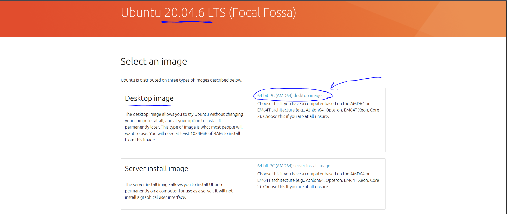

Сохраните файл в удобное место на вашем компьютере — главное, чтобы вы потом могли легко найти его при создании виртуальной машины.  
Дождитесь полной загрузки образа.

Вот как выглядит скачанный файл:

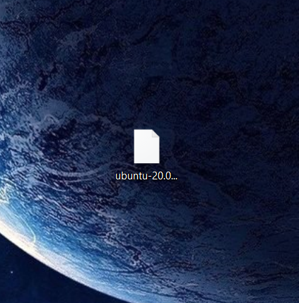

---

# 2. Создаём виртуальную машину в VMware

Запустите VMware и создайте новую виртуальную машину.  

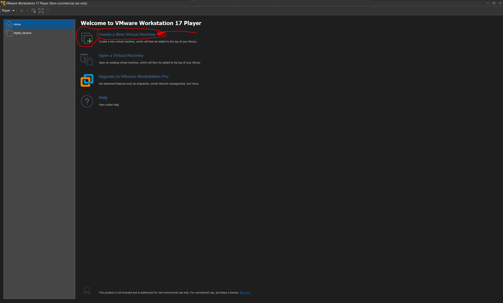

## Рекомендуемые настройки виртуальной машины:

- **Объём диска**: минимум 20 ГБ, но лучше выделить **40–50 ГБ** — это даст больше свободы в будущем.
- **Оперативная память (RAM)**: выделите столько, сколько позволяет ваша система, но **ориентируйтесь по оранжевой линии в настройках** — выбирайте максимальное значение **до начала оранжевого участка** (это поможет избежать перегрузки хост-системы).

Примеры настроек:

При создании укажите путь к скачанному ISO-образу в поле **«Образ ISO»**.

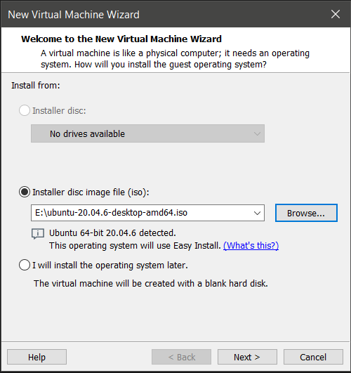  
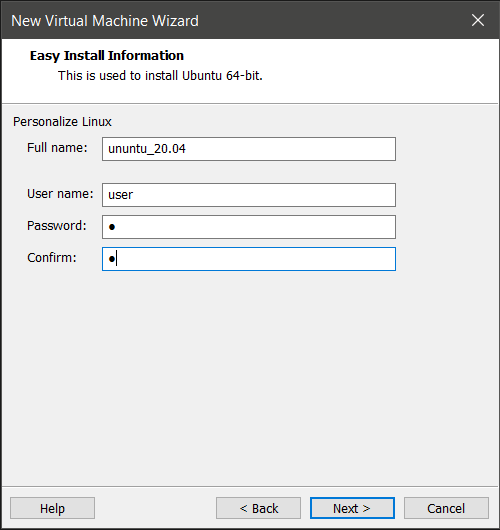  
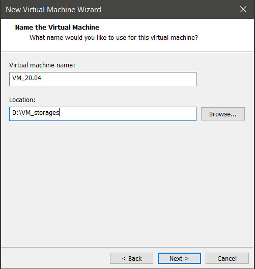  
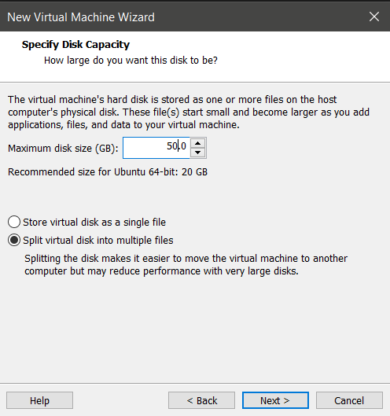  
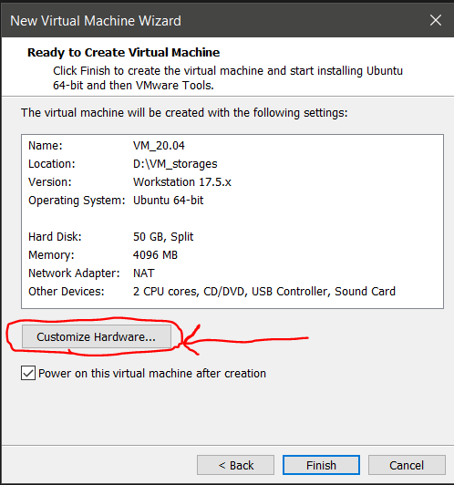  
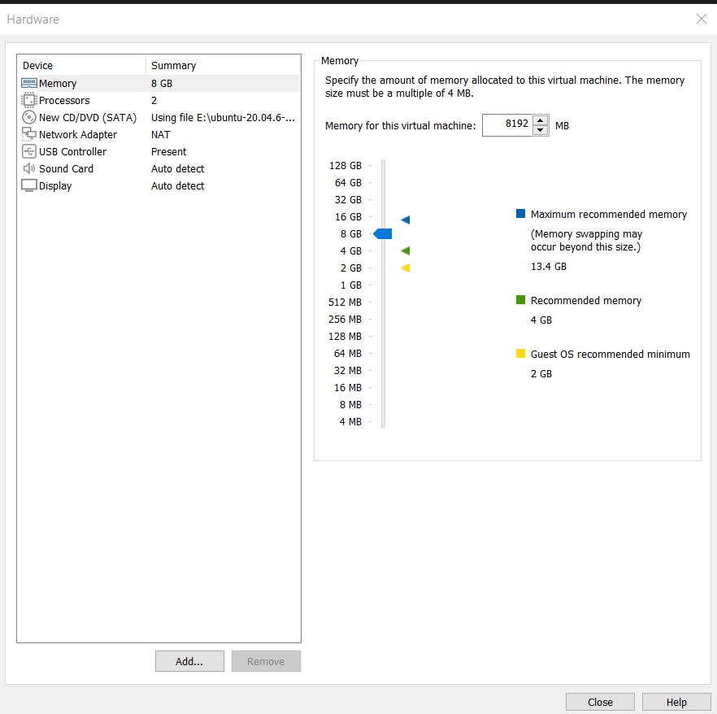  
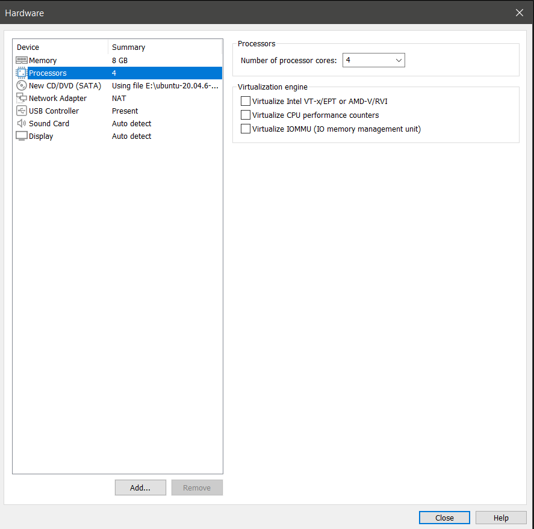
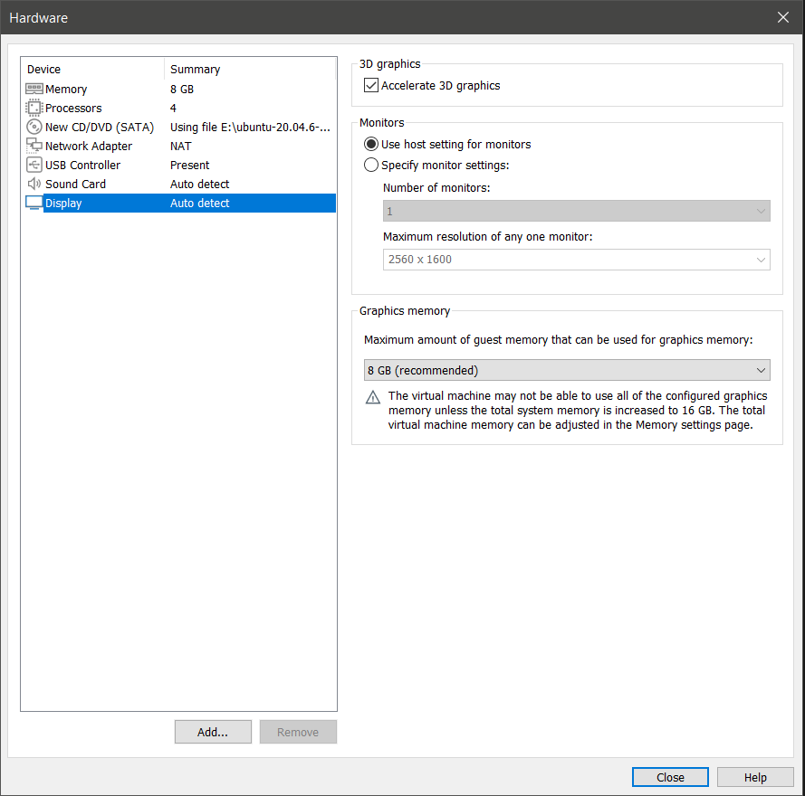  
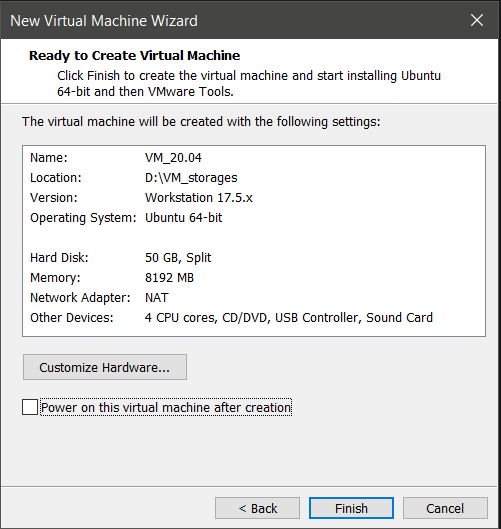
---

# 3. Запуск виртуальной машины

После завершения настройки запустите виртуальную машину.

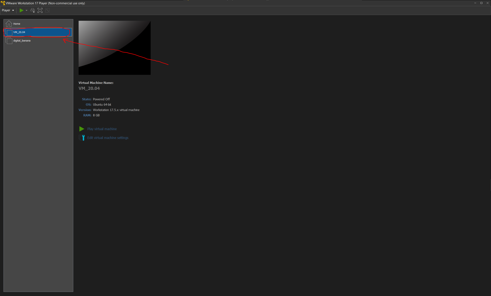  
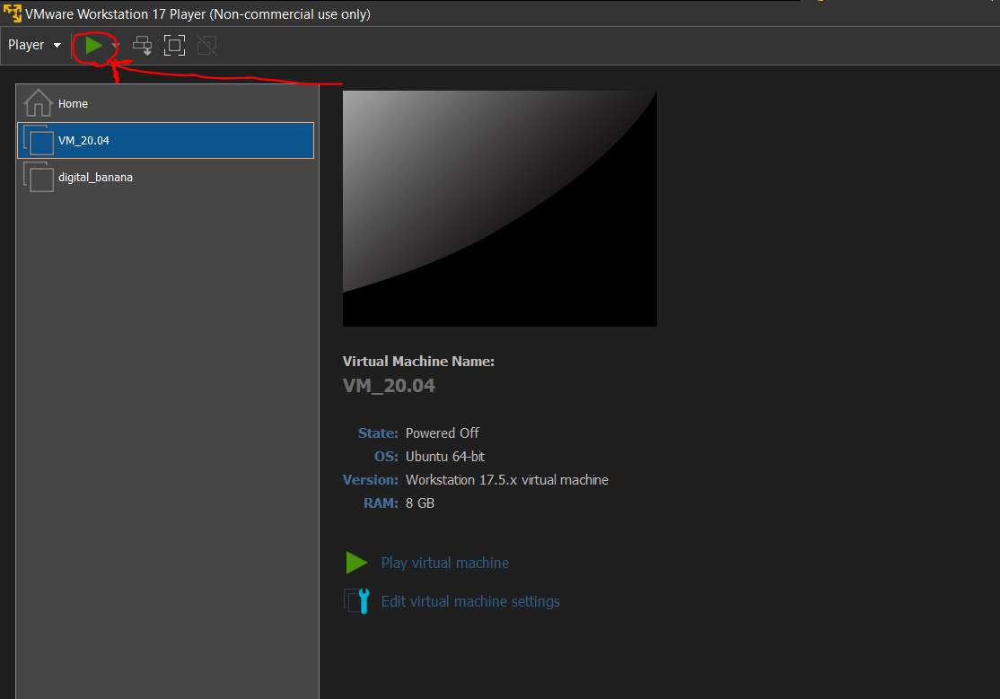

Загрузка Ubuntu может занять несколько минут, особенно при первом запуске. Просто подождите.

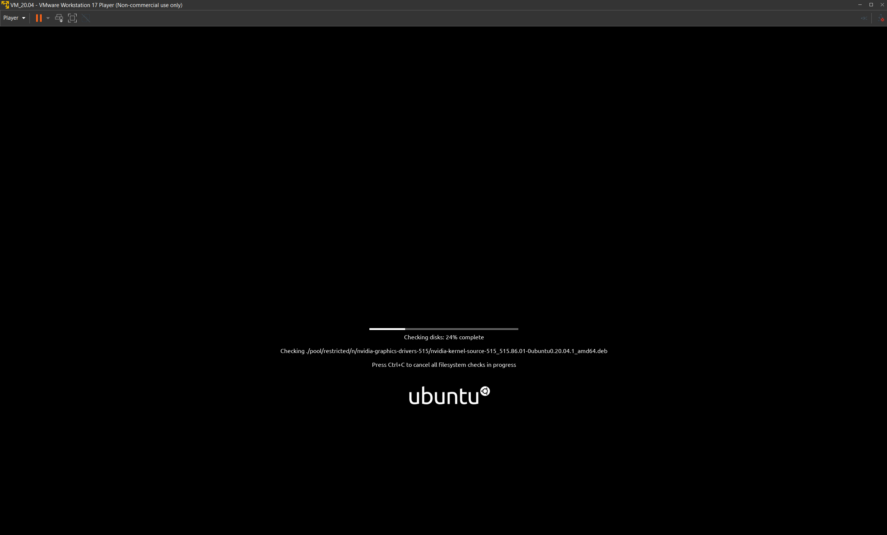  
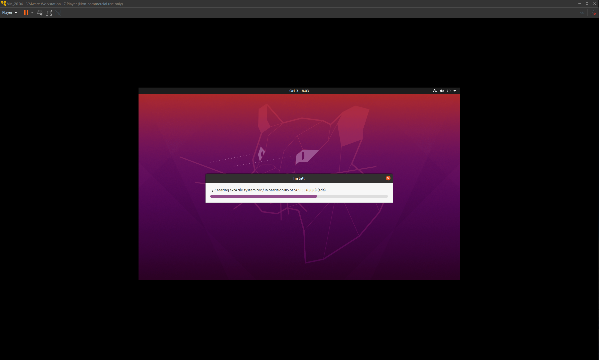  
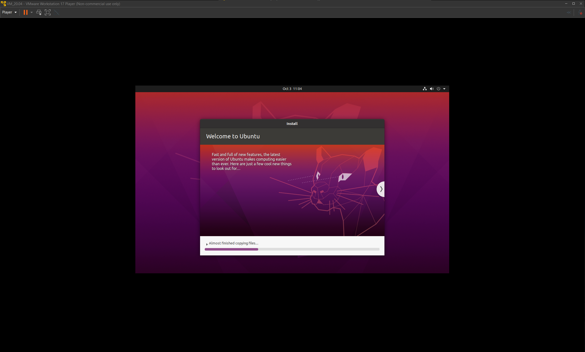

Когда система полностью загрузится, Вы увидите рабочий стол:

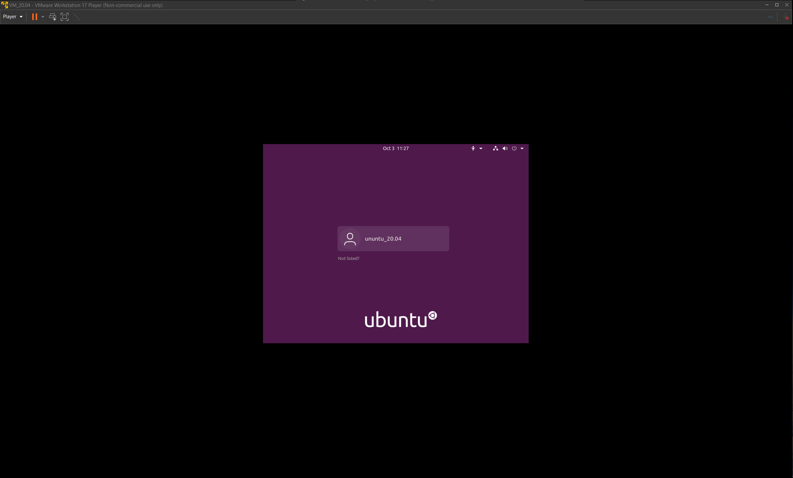

---

# 4. Настройка отображения

Чтобы окно Ubuntu занимало больше места на экране, измените разрешение экрана в Ubuntu.  
VMware автоматически подстроит разрешение после установки дополнений (они обычно устанавливаются позже), но даже сейчас можно растянуть окно вручную:

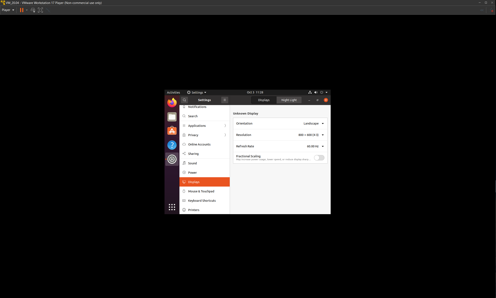

---

# 5. Добавление русского языка через графический интерфейс

1. **Откройте «Параметры» (Settings)**  
   Нажмите на значок меню в правом верхнем углу экрана → выберите шестерёнку ⚙️ → «Параметры».

2. **Перейдите в раздел «Язык и регион» (Language & Region)**  
   В левом меню выберите соответствующий пункт.

3. **Добавьте русский язык**  
   - Нажмите «Управление установленными языками» (Manage Installed Languages).  
   - Если появится запрос на установку языковых пакетов — нажмите «Установить».  
   - В окне «Языковая поддержка» (Language Support) нажмите «Установить/удалить языки…».  
   - Найдите **Russian**, поставьте галочку и нажмите «Применить».  
   - Дождитесь завершения загрузки и установки пакетов.