# 1. Скачиваем образ нужной операционной системы

Перейдите на [официальную страницу загрузки Ubuntu 20.04](https://releases.ubuntu.com/20.04/) и скачайте **Desktop-образ** для 64-битных систем:  
**`ubuntu-20.04.6-desktop-amd64.iso`** (размер около 4.1 ГБ).


*Рисунок 1 — Куда кликнуть, чтобы скачать Ubuntu*

Сохраните файл в удобное место на вашем компьютере — главное, чтобы Вы потом могли легко найти его при создании виртуальной машины.  
Дождитесь полной загрузки образа.

Вот как выглядит скачанный файл:

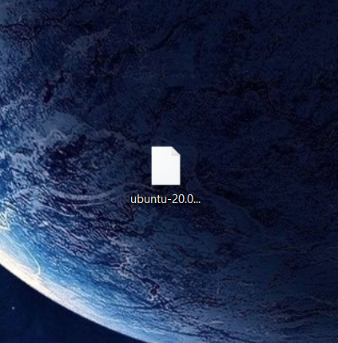

*Рисунок 2 — Как выглядит скачанный образ*

---

# 2. Создаём виртуальную машину в VMware

Запустите VMware и создайте новую виртуальную машину.  

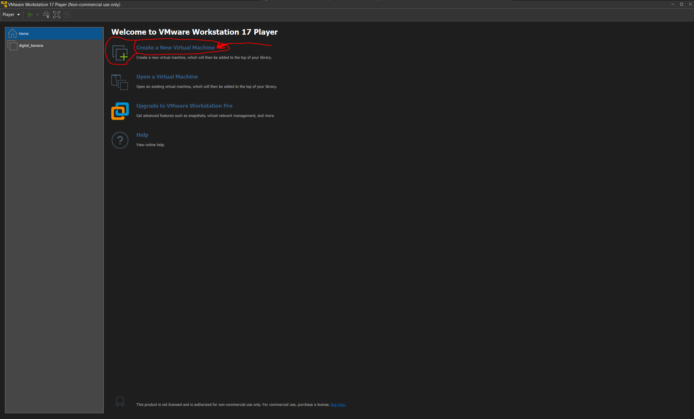

*Рисунок 3 — Куда кликнуть, чтобы создать виртуальную машину*

## Рекомендуемые настройки виртуальной машины:

- **Объём диска**: минимум 20 ГБ, но лучше выделить **40–50 ГБ** — это даст больше свободы в будущем.
- **Оперативная память (RAM)**: выделите столько, сколько позволяет ваша система, но **ориентируйтесь по оранжевой линии в настройках** — выбирайте максимальное значение **до начала оранжевого участка** (это поможет избежать перегрузки хост-системы).

Примеры настроек:

При создании укажите путь к скачанному ISO-образу в поле **«Образ ISO»**.

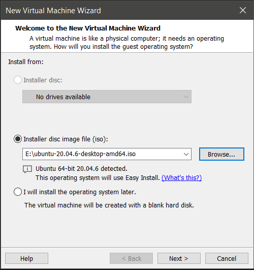

*Рисунок 4 — Окно настройки конфигурации №1*

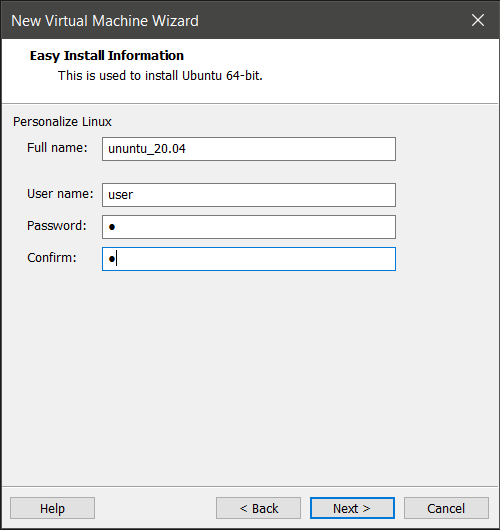

*Рисунок 5 — Окно настройки конфигурации №2*


*Рисунок 6 — Окно настройки конфигурации №3*

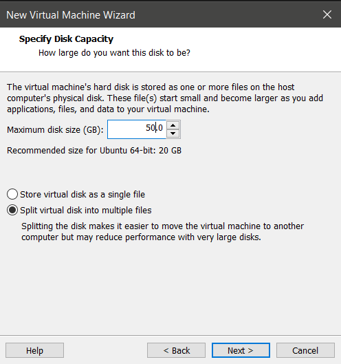

*Рисунок 7 — Окно настройки конфигурации №4*

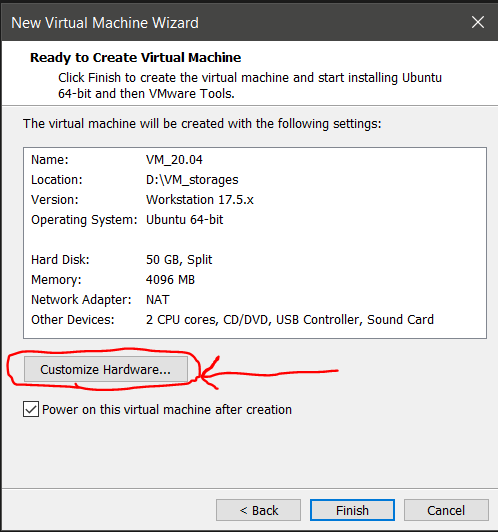

*Рисунок 8 — Окно настройки конфигурации №5*

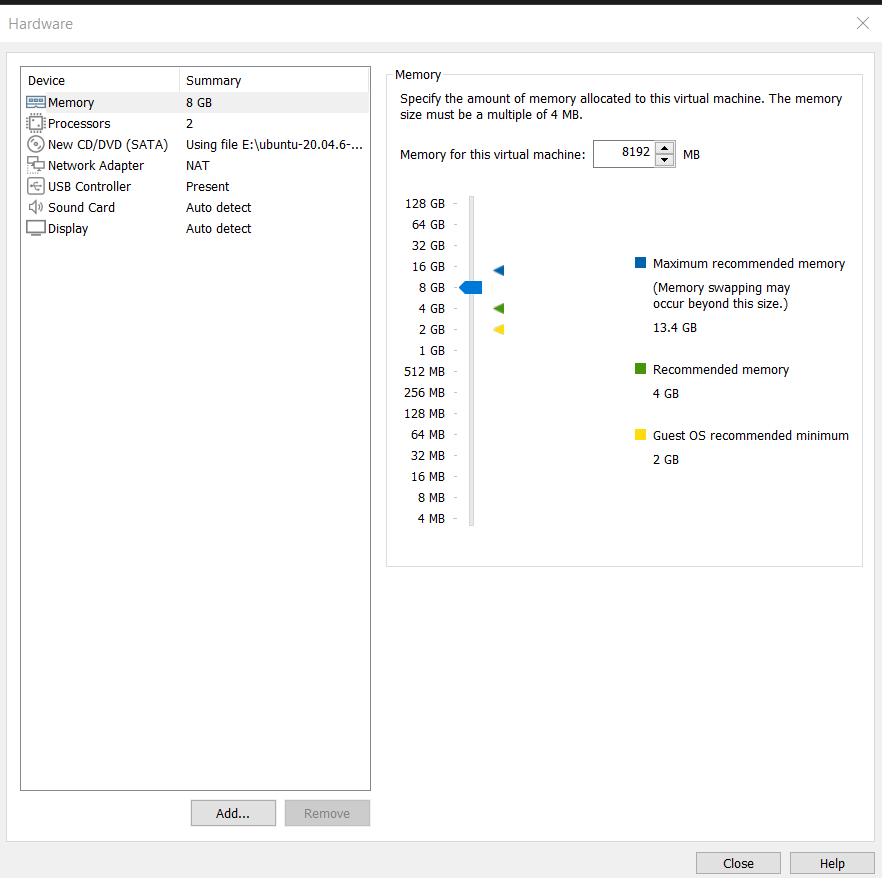

*Рисунок 9 — Окно настройки конфигурации №6*


*Рисунок 10 — Окно настройки конфигурации №7*


*Рисунок 11 — Окно настройки конфигурации №8*

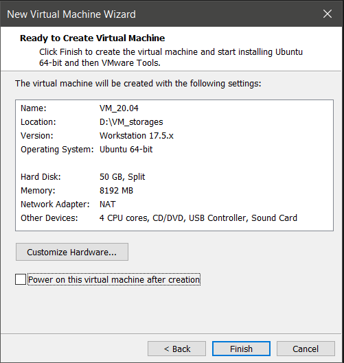

*Рисунок 12 — Окно настройки конфигурации №9*

---

# 3. Запуск виртуальной машины

После завершения настройки запустите виртуальную машину.


*Рисунок 13 — Куда кликнуть, чтобы выбрать созданную виртуальную машину*


*Рисунок 14 — Куда кликнуть, чтобы запустить созданную виртуальную машину*

Загрузка Ubuntu может занять несколько минут, особенно при первом запуске. Просто подождите.

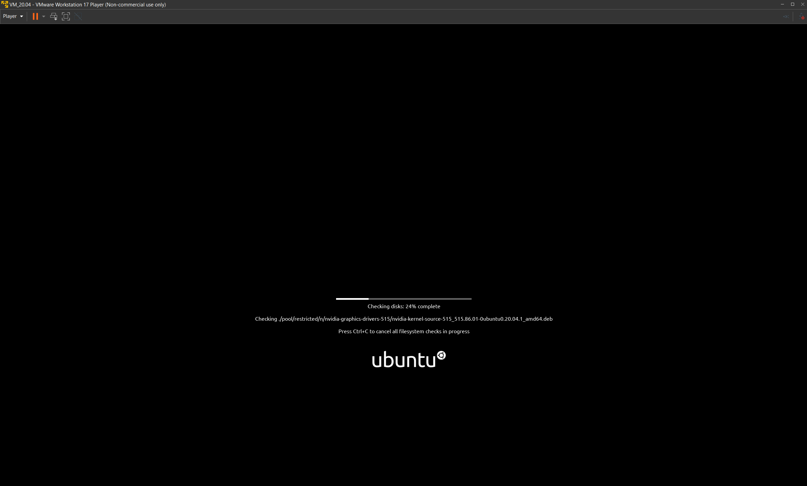

*Рисунок 15 — Установка OS Linux Ubuntu окно №1*

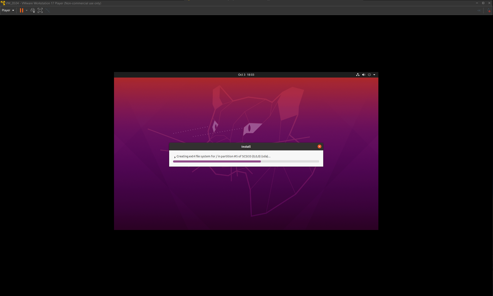

*Рисунок 16 — Установка OS Linux Ubuntu окно №2*

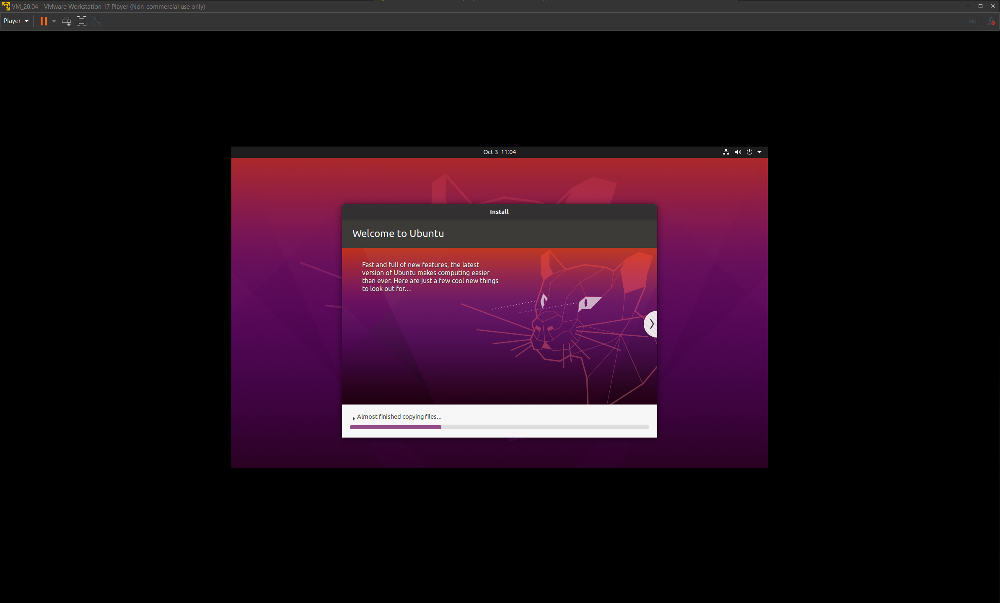

*Рисунок 17 — Установка OS Linux Ubuntu окно №3*

Когда система полностью загрузится, Вы увидите окно выбора пользователя: 


*Рисунок 18 — Выбор пользователя*

Войдя в профиль пользователя, Вы увидите Рабочий стол.

---

# 4. Настройка отображения

Чтобы окно Ubuntu занимало больше места на экране, измените разрешение экрана в Ubuntu.  
VMware автоматически подстроит разрешение после установки дополнений (они обычно устанавливаются позже), но даже сейчас можно растянуть окно вручную:


*Рисунок 19 — Изменение разрешения*

---

# 5. Обновление системы

После установки Ubuntu, Вам необходимо обновить все пакеты, которые установлены в системе до последней актуальной версии. 
Для этого необходимо в терминале (сочетание клавиш `Ctrl + Alt + T` запустит новый терминал) последовательно выполнить команды:

1. Проверяем наличие обновлений для пакетов, которые уже установлены в системе:

```bash
sudo apt update
```

> Вас попросят ввести пароль пользователя. Вводите его вслепую — символы не отображаются, но вводятся. Затем нажмите Enter.

2. Обновляем пакеты до последних доступных версий:
```bash
sudo apt upgrade -y
```
> Ключ `-y` избавляет от необходимости вручную подтверждать обновление во время выполнения команды.  

---

# 6. (Дополнительно) добавление русского языка через графический интерфейс

1. **Откройте «Параметры» (Settings)**  
   Нажмите на значок меню в правом верхнем углу экрана → выберите шестерёнку → «Параметры».

   

   *Рисунок 20 — Место нахождения настроек*

2. **Перейдите в раздел «Язык и регион» (Language & Region)**  
   В левом меню выберите соответствующий пункт.

   

   *Рисунок 21 — Language & Region*

3. **Добавьте русский язык**  
   - Нажмите на  «+», чтобы добавить новый язык.  

   

   *Рисунок 22 — Добавление языка окно 1*

   - Нажмите на три вертикальные точки, чтобы посмотреть все языки.   

   

   *Рисунок 23 — Добавление языка окно 2*

   - Найдите строку «Russian», нажмите на неё и нажимте «Добавить».  

   

   *Рисунок 24 — Добавление языка окно 3*

   - После добавления русского языка, Вы увидите его в списке языков и сверху на панели, слева от настроек сети, появится кнопка выбора языка.  

   

   *Рисунок 25 — Изменения после добавления языка*

   
   По умолчанию переключение языка осуществляется клавишами Win (В Linux она называется Super) + Space (Пробел)