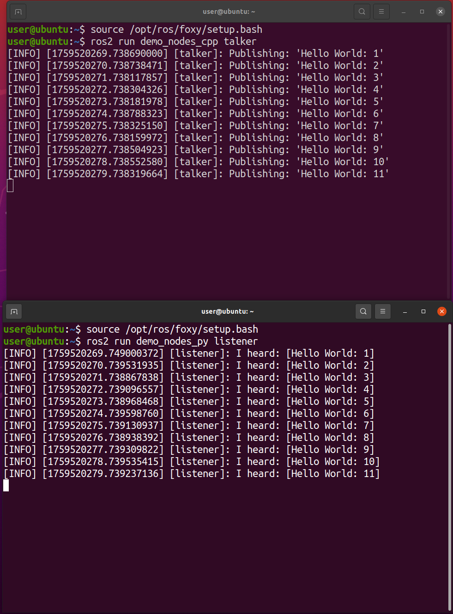

**Понятная пошаговая инструкция для новичков** по установке **ROS 2 Foxy Fitzroy** на **Ubuntu 20.04**.  
Все команды нужно выполнять **по очереди** в терминале. После каждой команды дождитесь её завершения, прежде чем вводить следующую.

---

### 🔧 Шаг 1: Откройте терминал
Нажмите на клавиатуре:  
**Ctrl + Alt + T** — откроется окно терминала.

---

### 🌍 Шаг 2: Убедитесь, что система использует UTF-8 (нужно для корректной работы ROS)
Вставьте в терминал:
```bash
locale
```
Если в выводе нет `en_US.UTF-8` или похожего — продолжайте следующие шаги. Если уже всё в порядке — можно пропустить, но лучше выполнить всё подряд, чтобы не ошибиться.

---

### 🔄 Шаг 3: Обновите список пакетов и установите поддержку локалей
```bash
sudo apt update
```
> Вас попросят ввести **пароль пользователя**. Вводите его **вслепую** — символы не отображаются, но вводятся. Нажмите Enter.

Затем выполните:
```bash
sudo apt install locales
sudo locale-gen en_US en_US.UTF-8
sudo update-locale LC_ALL=en_US.UTF-8 LANG=en_US.UTF-8
export LANG=en_US.UTF-8
```

Проверьте, что всё настроилось:
```bash
locale
```
В выводе должны быть строки вроде:
```
LANG=en_US.UTF-8
LC_ALL=en_US.UTF-8
```

---

### 📦 Шаг 4: Установите необходимые вспомогательные программы
```bash
sudo apt install software-properties-common
```

Добавьте репозиторий `universe` (он нужен для некоторых пакетов ROS):
```bash
sudo add-apt-repository universe
```

---

### 🔑 Шаг 5: Добавьте официальный ключ и репозиторий ROS 2
Сначала обновите пакеты и установите `curl` (если ещё не установлен):
```bash
sudo apt update && sudo apt install curl -y
```

Теперь скачайте ключ безопасности ROS:
```bash
sudo curl -sSL https://raw.githubusercontent.com/ros/rosdistro/master/ros.key -o /usr/share/keyrings/ros-archive-keyring.gpg
```

Добавьте репозиторий ROS 2 в систему:
```bash
echo "deb [arch=$(dpkg --print-architecture) signed-by=/usr/share/keyrings/ros-archive-keyring.gpg] http://packages.ros.org/ros2/ubuntu $(. /etc/os-release && echo $UBUNTU_CODENAME) main" | sudo tee /etc/apt/sources.list.d/ros2.list > /dev/null
```

---

### 🤖 Шаг 6: Установите ROS 2 Foxy
Обновите список пакетов ещё раз:
```bash
sudo apt update
```

Установите основной пакет ROS 2 с графическим интерфейсом (desktop-версия) и полезные инструменты:
```bash
sudo apt install ros-foxy-desktop python3-argcomplete
sudo apt install ros-dev-tools
```
> Это может занять **10–30 минут**, в зависимости от скорости интернета и компьютера.

---

### 🚀 Шаг 7: Настройте среду ROS 2 в текущей сессии терминала
Чтобы ROS 2 «захватил» ваш терминал, выполните:
```bash
source /opt/ros/foxy/setup.bash
```

> ⚠️ Эта команда **действует только в этом окне терминала**. Чтобы не вводить её каждый раз, можно добавить её в файл `~/.bashrc` (см. ниже).

---

### ✅ Шаг 8: Проверьте установку — запустите пример
Откройте **два новых окна терминала** (**Ctrl + Alt + T** дважды).

**В первом окне** запустите «говорящий» узел:
```bash
source /opt/ros/foxy/setup.bash
ros2 run demo_nodes_cpp talker
```
Вы увидите сообщения вида: `[INFO] [talker]: Publishing: 'Hello World: 1'`

**Во втором окне** запустите «слушающий» узел:
```bash
source /opt/ros/foxy/setup.bash
ros2 run demo_nodes_py listener
```
Вы должны увидеть те же сообщения: `[INFO] [listener]: I heard: [Hello World: 1]`



Если это работает — **ROS 2 установлен успешно!** 🎉

---

### 💡 Совет: Автоматическая настройка ROS при запуске терминала
Чтобы не вводить `source /opt/ros/foxy/setup.bash` каждый раз, добавьте её в конец файла `~/.bashrc`:
```bash
echo "source /opt/ros/foxy/setup.bash" >> ~/.bashrc
```
Теперь ROS будет доступен автоматически в каждом новом терминале.
