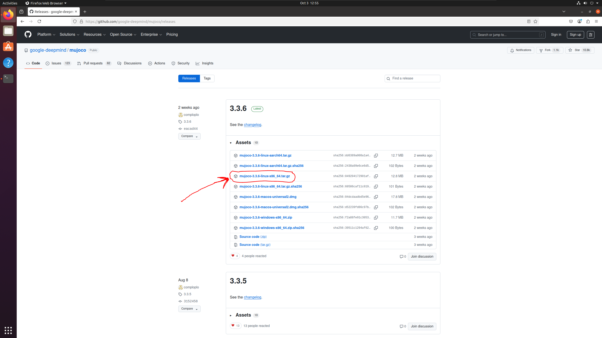
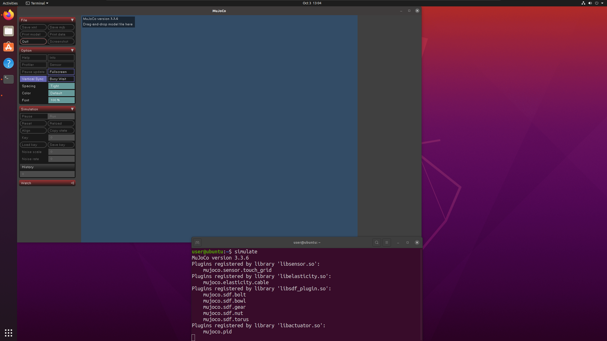
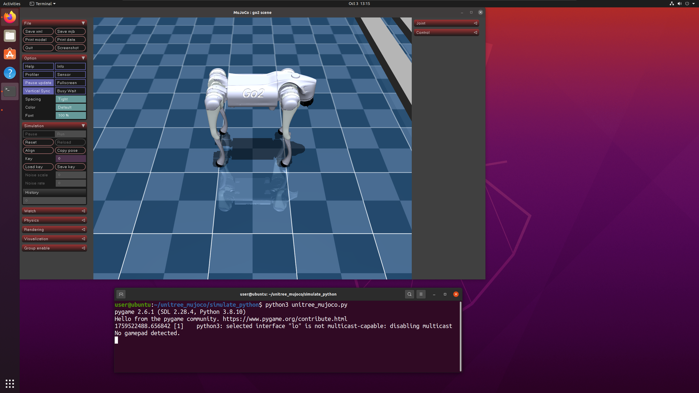
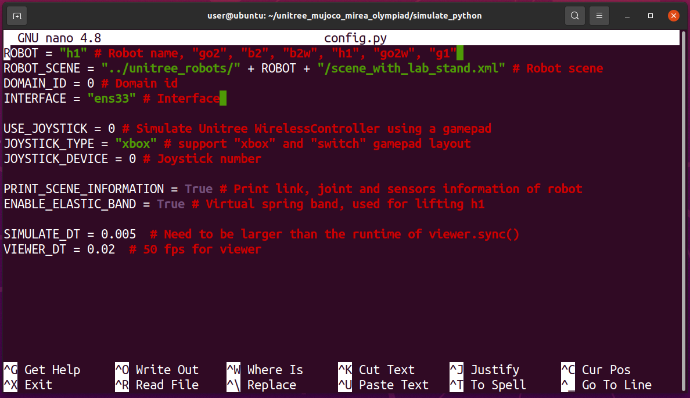
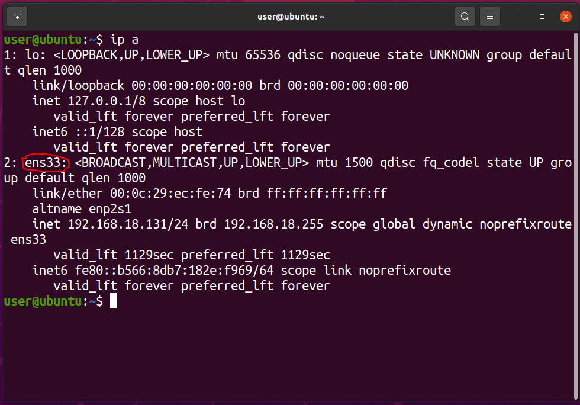
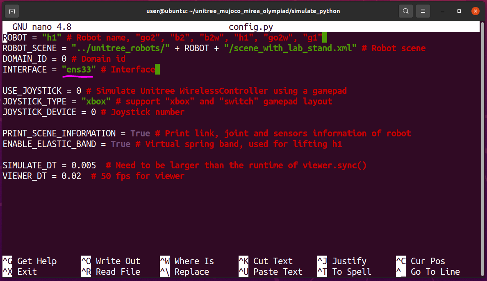
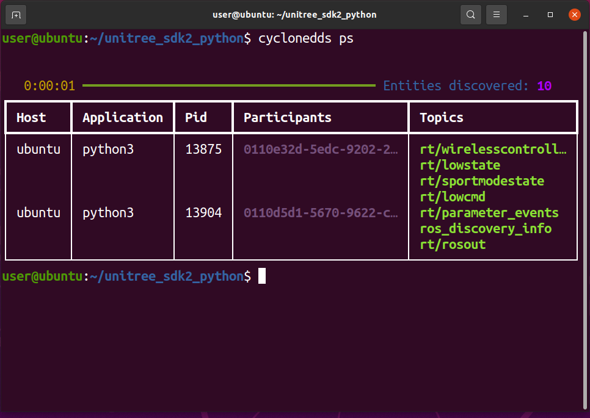

# 🧪 Установка и запуск MuJoCo + симуляция робота Unitree (для новичков)

> Эта инструкция поможет Вам установить MuJoCo — физический симулятор — и запустить в нём робота от компании Unitree (например, собаку или гуманоида H1). Всё делается в терминале Linux (например, Ubuntu).

---

## 🔽 Шаг 1: Скачиваем MuJoCo

1. Перейдите на официальную страницу релизов MuJoCo:  
   👉 [https://github.com/google-deepmind/mujoco/releases](https://github.com/google-deepmind/mujoco/releases)

2. Найдите и скачайте архив **`mujoco-3.3.6-linux-x86_64.tar.gz`** (или последнюю версию для Linux).  
   Обычно он сохраняется в папку **`Загрузки`** (или `~/Downloads`).

   

---

## 📦 Шаг 2: Распаковываем MuJoCo

Откройте **терминал** и выполните команду:

```bash
sudo tar -xvzf ~/Downloads/mujoco-3.3.6-linux-x86_64.tar.gz -C /opt/
```

> 💡 Эта команда распакует MuJoCo в системную папку `/opt/`, чтобы он был доступен всем пользователям.

---

## 🔗 Шаг 3: Делаем MuJoCo доступным из любой папки

Чтобы можно было запускать симулятор просто командой `simulate`, создадим символическую ссылку:

```bash
sudo ln -s /opt/mujoco-3.3.6/bin/simulate /usr/local/bin/simulate
```

---

## ✅ Шаг 4: Проверяем установку

В терминале введите:

```bash
simulate
```

Если всё сделано правильно, откроется окно симулятора MuJoCo:



Теперь MuJoCo установлен! Закройте окно, оно более нам не понадобится. 

---

## 🤖 Шаг 5: Клонируем симуляцию робота Unitree

Выполните в терминале:

```bash
cd ~
git clone https://github.com/cyberbanana777/unitree_mujoco_mirea_olympiad.git
```

> Это скачает код для запуска роботов Unitree (собака, гуманоид и т.д.) в MuJoCo.

---

## 🧩 Шаг 6: Устанавливаем зависимости Python

MuJoCo и интерфейс управления работают через Python. Установим нужные библиотеки:

```bash
pip3 install mujoco pygame
```

> 💡 Убедитесь, что у Вас установлен `pip3`. Если нет — установите через `sudo apt install python3-pip`.
>

Ничего не нужно делать, если появилась вот такая ошибка:
```bash
ERROR: importlib-resources 6.4.5 has requirement zipp>=3.1.0; python_version < "3.10", but you'll have zipp 1.0.0 which is incompatible.
```

Просто перейдите к шагу 7.


---

## 🐕 Шаг 7: Запускаем антропоморфного робота Unitree H1

Перейдите в папку симуляции и запустите скрипт:

```bash
cd ~/unitree_mujoco_mirea_olympiad/simulate_python
python3 unitree_mujoco.py
```

Должен появиться **робот Unitree H1**, который просто стоит на месте (может не двигаться):



Если робот не двигается и симуляция как будто остановилась, выполните шаги 8 и 9.

---

## ⚙️ Шаг 8: Настраиваем подключени

Сейчас симуляция не "общается" с ROS2. Нужно указать правильный сетевой интерфейс и выбрать нужного робота.

1. Открой файл настроек:

   ```bash
   nano config.py
   ```

   Он выглядит так:

   

2. Открой **новый терминал** и выполни:

   ```bash
   ip a
   ```

   Найди активный сетевой интерфейс (обычно `wlan0`, `eth0` или `enp...`):

   

3. Вернитесь в `config.py` и измените:
   - `interface` — укажите имя Вашего сетевого интерфейса (например, `"wlan0"`),
   - убедись, что остальные параметры (подчёркнутые фиолетовым) тоже правильные.

   Пример исправленного файла:

   

4. Сохраните файл:  
   В `nano` нажмите `Ctrl+O` → Enter → `Ctrl+X`.

---

## ▶️ Шаг 9: Запускаем симуляцию снова

```bash
cd ~/unitree_mujoco_mirea_olympiad/simulate_python
python3 unitree_mujoco.py
```

Теперь робот должен двигаться, и симуляция будет работать корректно, пример в коротком видео по ссылке:

[Unitree H1 в mujoco](https://disk.yandex.ru/i/MjWAQHr5EcbZmQ)


---

## 📡 Шаг 10: Настраиваем ROS2 (чтобы появлялись топики)

Чтобы симуляция "разговаривала" с ROS2, нужно убедиться, что транспортный уровень (DDS) работает. Смотреть наличие специальных топиков нужно, очевидно при запущенной симуляции Unitree H1 в Mujoco.

1. Добавьте путь к локальным программам в `.bashrc`:

   ```bash
   echo 'export PATH="$HOME/.local/bin:$PATH"' >> ~/.bashrc
   ```

2. Перезагрузите настройки терминала:

   ```bash
   source ~/.bashrc
   ```

3. Проверьте, работает ли CycloneDDS (транспорт ROS2) (Mujoco с роботом H1 должна быть запущена, что бы топики были):

   ```bash
   cyclonedds ps
   ```

   Должен появиться список процессов:

   

4. Посмотрите список ROS2-топиков:

   ```bash
   ros2 topic list
   ```

   **Правильный вывод** должен включать топики от робота:

   ```
   /lowcmd
   /lowstate
   /parameter_events
   /rosout
   /sportmodestate
   /wirelesscontroller
   ```

   Если видите только `/parameter_events` и `/rosout` — значит, ROS2-демон не видит симуляцию.
   
   ```
   /parameter_events
   /rosout
   ```

   **Исправление:**

   ```bash
   ros2 daemon stop
   ros2 daemon start
   ros2 topic list
   ```

   Теперь топики должны появиться!
