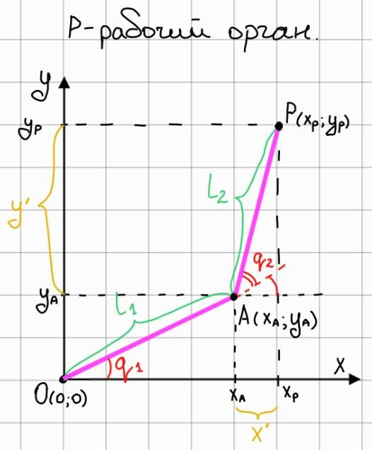

## 1. Постановка задач кинематики в робототехнике

В теории управления манипуляционными роботами кинематический анализ является фундаментальным этапом. Он подразделяется на две основные задачи: **прямую** и **обратную** задачу кинематики.

*   **Прямая задача кинематики (ПЗК)** заключается в определении положения и ориентации рабочего органа (энд-эффector) манипулятора по известным кинематической схеме (длинам звеньев) и значениям обобщённых координат (например, углов поворота в сочленениях $q_1, q_2, \dots, q_n$, где $n$ — число степеней свободы).
*   **Обратная задача кинематики (ОЗК)** заключается в определении значений обобщённых координат $q_1, q_2, \dots, q_n$, которые обеспечивают заданное положение и ориентацию рабочего органа в пространстве.

Таким образом, ПЗК отвечает на вопрос: «**Где окажется рабочий орган при заданных углах в сочленениях?**» В то время как ОЗК решает противоположную проблему: «**Как должны быть установлены углы в сочленениях, чтобы рабочий орган достиг требуемого положения?**»

Для задач планирования траектории и управления **обратная задача кинематики** является более важной и распространённой на практике. Однако её решение сопряжено с фундаментальной сложностью — **неоднозначностью**. Если для любого набора углов $(q_1, q_2, \dots, q_n)$ существует единственное положение рабочего органа $(x, y, z)$ (следствие определения ПЗК), то для заданного положения $(x, y, z)$ может существовать несколько различных конфигураций манипулятора (наборов углов $(q_1', q_2', \dots, q_n')$ ), обеспечивающих его достижение. При аналитическом решении ОЗК эта неоднозначность проявляется, например, через выбор знака при извлечении квадратного корня или через периодичность тригонометрических функций.

---

## 2. Пример решения для плоского двухзвенного манипулятора

Для иллюстрации рассмотрим классический пример — плоский двухзвенный манипулятор с двумя вращательными степенями свободы.

**Дано:**

*   Длина первого звена (плеча): $l_1$
*   Длина второго звена (предплечья): $l_2$
*   Угол поворота первого звена относительно основания: $q_1$
*   Угол поворота второго звена относительно первого: $q_2$
*   Рабочий орган расположен на конце второго звена.

### 2.1. Решение прямой задачи кинематики

**Цель:** Найти декартовы координаты $(x_p, y_p)$ рабочего органа.

Положение точки сочленения между первым и вторым звеном $A$ в базовой системе координат $O$ определяется как:

$$x_A = l_1 \cdot \cos(q_1)$$
$$y_A = l_1 \cdot \sin(q_1)$$

Второе звено в базовой системе координат повёрнуто на угол $q_1 + q_2$. Следовательно, проекции вектора $l_2$ на оси координат равны:

$$x' = l_2 \cdot \cos(q_1 + q_2)$$
$$y' = l_2 \cdot \sin(q_1 + q_2)$$

Результирующие координаты рабочего органа находятся векторным сложением:

$$x_p = x_A + x' = l_1 \cdot \cos(q_1) + l_2 \cdot \cos(q_1 + q_2)$$
$$y_p = y_A + y' = l_1 \cdot \sin(q_1) + l_2 \cdot \sin(q_1 + q_2)$$

Данная система уравнений представляет собой решение ПЗК для рассматриваемого манипулятора.

На рисунке 1 представлено схематичное изображение манипулятора с 2
вращательными звеньями с обозначениями, соответствующими описанию
решения ПЗК.

*Рисунок 1 - Схематичное изображение манипулятора с 2 вращательными звеньями с обозначениями, соответствующими описанию решения ПЗК*

### 2.2. Решение обратной задачи кинематики

**Цель:** По заданным координатам рабочего органа $(x_p, y_p)$ найти углы $q_1$ и $q_2$.

Введём вспомогательные величины:

*   $b = \sqrt{ x_p^2 + y_p^2 }$ — расстояние от основания манипулятора до целевой точки.
*   $q_1' = \arctan2(y_p, x_p)$ — угол между осью $OX$ и вектором $b$. Использование функции `arctan2` корректно определяет квадрант угла.

Для треугольника, образованного звеньями $l_1$, $l_2$ и отрезком $b$, по теореме косинусов:

$$l_2^2 = l_1^2 + b^2 - 2 \cdot l_1 \cdot b \cdot \cos(q_2')$$

где $q_2'$ — угол между $l_1$ и $b$. Отсюда:

$$\cos(q_2') = \frac{l_1^2 + b^2 - l_2^2}{2 \cdot l_1 \cdot b}$$
$$q_2' = \arccos\left( \frac{l_1^2 + b^2 - l_2^2}{2 \cdot l_1 \cdot b} \right)$$

Первое решение для углов (конфигурация "локоть вниз"):

$$q_1 = q_1' - q_2'$$
$$q_2 = \pi - \arccos\left( \frac{L_1^2 + L_2^2 - B^2}{2 \cdot L_1 \cdot L_2} \right)$$

Графическая интерпретация представлена на рисунке 2.

*Рисунок 2 - Графическая интерпретация решения ОЗК для двухзвенного
манипулятора с конфигурацией "локоть вниз"*

Второе решение (конфигурация "локоть вверх"):

$$q_1 = q_1' + q_2'$$
$$q_2 = - \left[ \pi - \arccos\left( \frac{l_1^2 + l_2^2 - b^2}{2 \cdot l_1 \cdot l_2} \right) \right] = \arccos\left( \frac{l_1^2 + l_2^2 - b^2}{2 \cdot l_1 \cdot l_2} \right) - \pi$$

Графическая интерпретация представлена на рисунке 3.

*Рисунок 3 - Графическая интерпретация решения ОЗК для двухзвенного
манипулятора с конфигурацией "локоть вверх"*

**Возникновение неоднозначности:** Два различных решения появляются из-за свойства чётности функции косинус $\cos(\theta) = \cos(-\theta)$, что эквивалентно выбору знака при геометрическом построении. На практике выбор конфигурации определяется дополнительными ограничениями (например, областью изменения углов, препятствиями в рабочей зоне).
